# Documentation Architecture & Reading Guide

**Project:** GEODIS New HCM - AMARIS
**Phase:** 02 - Define
**Created:** 2025-11-30
**Purpose:** Meta-documentation explaining how all pieces fit together

---

## 1. Four-Layer Documentation Model

```mermaid
graph TB
    subgraph "LAYER 1: META & NAVIGATION"
        L1_00["00 Documentation Index<br>📍 Start Here"]
        L1_01["01 Agent Session Tracker<br>📊 Progress & Context"]
        L1_05["05 Implementation Methodology<br>📋 7-Phase Approach"]
        L1_08["08 Oracle Documentation Index<br>📚 PDF References"]
    end

    subgraph "LAYER 2: FUNCTIONAL DESIGN"
        L2_02["02 Oracle HCM Dimensions<br>🏗️ Target Model Definition"]
        L2_04["04 Mercer Grade Mapping<br>💰 Compensation Structure"]
        L2_06["06 Repository Config Guide<br>⚙️ Detailed Specs"]
    end

    subgraph "LAYER 3: SOURCE DATA & MAPPING"
        L3_03["03 MDM to HCM Mapping<br>🔗 Source → Target"]
        L3_07["07 MDM HR Refinement<br>🔍 HR Data Analysis"]
        L3_09["09 MDM HR Analysis Report<br>📊 12 files, 1.2M records"]
        L3_13["13 MDM MAB Analysis Report<br>📊 15 files, SOUs/Local SOUs"]
    end

    subgraph "LAYER 4: GOVERNANCE & ADVANCED"
        L4_10["10 Open Decisions Checklist<br>❓ Pending vs Resolved"]
        L4_11["11 Core HR Consistency Audit<br>✅ Data Quality"]
        L4_12["12 Global Analytical Allocation<br>💳 Costing Model (Light)"]
        L4_14["14 Multialocation MAB<br>⭐ MASTER: Allocation + Governance"]
    end

    L1_00 -.->|navigate to| L2_02
    L1_00 -.->|navigate to| L3_03
    L1_05 -->|defines| L2_02
    L2_02 -->|implemented via| L2_06
    L3_03 -->|maps from| L3_09
    L3_03 -->|maps from| L3_13
    L4_12 -.->|superseded by| L4_14

    style L1_00 fill:#1565c0,color:#fff
    style L4_14 fill:#c62828,color:#fff
    style L4_12 fill:#757575,color:#fff
```



---

## 2. Recommended Reading Paths

### Path A: New Team Member Onboarding


### Path B: Quick Context (Executive/Steering)


### Path C: Technical Integrator


---

## 3. Document Dependency Matrix


---

## 4. Strengths Summary

| Area | Status | Evidence |
|------|--------|----------|
| **Repository Maturity** | ✅ Very High | 69/70 sheets, ~27,000 records |
| **Methodology Alignment** | ✅ Strong | Methodology ↔ Dimensions ↔ Specs ↔ Mapping ↔ Oracle Docs |
| **Analytics & Costing** | ✅ Advanced | Global Analytical Allocation + HCM Payroll + FTE KPIs |
| **Data Governance** | ✅ Baked In | MDM roles, decisions log, Python audit scripts |
| **Source Documentation** | ✅ Thorough | 12 HR files (1.2M records) + 15 MAB files analyzed |

---

## 5. Gaps & Open Items

### 5.1 Pending Business Decisions


### 5.2 Design Areas to Flesh Out

| Area | Current State | Action Needed |
|------|---------------|---------------|
| **Security Matrix** | Placeholder in 06 | Define roles, data access rules |
| **Approval Workflows** | Placeholder in 06 | Map business process approvals |
| **Position Management** | Optional (Phase 2+) | Confirm if/when to enable |
| **Time Zone Handling** | Not addressed | Define per-location or per-LDG |

### 5.3 Document Cleanup

| Document | Issue | Recommendation |
|----------|-------|----------------|
| **12 Global Analytical Allocation** | Superseded by 14 | Mark as "ARCHIVED" or "Light Conceptual" |
| **14 Multialocation MAB** | Is the MASTER | Add header badge: "⭐ MASTER DOCUMENT" |

---

## 6. Document Status Matrix


---

## 7. Cross-Reference Quick Lookup

### By Oracle HCM Object

| HCM Object | Primary Doc | Supporting Docs |
|------------|-------------|-----------------|
| Enterprise | 02 Dimensions §2.1 | 06 Repository |
| Legal Entity | 02 Dimensions §2.2 | 03 Mapping, 13 MAB |
| LDG | 02 Dimensions §2.3 | 03 Mapping |
| Division | 02 Dimensions §3.1 | 06 Repository |
| Business Unit | 02 Dimensions §3.2 | 03 Mapping, 13 MAB |
| Department | 02 Dimensions §3.3 | 03 Mapping, 09 HR |
| Location | 02 Dimensions §5.2 | 03 Mapping |
| Job | 02 Dimensions §6.1 | 03 Mapping, 09 HR |
| Grade | 02 Dimensions §6.3 | 04 Mercer |
| Cost Center | 02 Dimensions §4.3 | 14 Multialocation |
| SOU/Local SOU | 02 Dimensions §4.2-4.3 | 13 MAB, 14 Multialocation |

### By MDM Source

| Source File | Analysis Doc | Mapping Doc |
|-------------|--------------|-------------|
| KeyPropertiesNewIE.csv | 09 HR Analysis | 03 Mapping |
| JobRepositoryNewIE.csv | 09 HR Analysis | 03 Mapping, 07 Refinement |
| Organisations.csv | 09 HR Analysis | 03 Mapping |
| SOUs View.csv | 13 MAB Analysis | 14 Multialocation |
| Local SOUs.csv | 13 MAB Analysis | 14 Multialocation |
| Reporting Units View.csv | 13 MAB Analysis | 03 Mapping |
| Local Legal Entities.csv | 13 MAB Analysis | 03 Mapping |

---

## 8. Session Context for AI Agents

When resuming work, provide this context:

```
Continue the GEODIS HCM implementation.

Documentation Architecture:
- Layer 1 (Meta): 00, 01, 05, 08
- Layer 2 (Design): 02, 04, 06
- Layer 3 (Sources): 03, 07, 09, 13
- Layer 4 (Advanced): 10, 11, 12→14

Master Documents:
- 02 Oracle HCM Dimensions = Target model truth
- 14 Multialocation MAB = Allocation & governance truth
- 06 Repository Guide = Implementation specs truth

Current Status: 69/70 repositories, ~27,000 records
Output: GEODIS_Repositories_CORE HR_FILLED_v2.xlsx

Open Items: See 10_Open_Decisions_Checklist.md
```

---

## Document Control

| Version | Date | Changes |
|---------|------|---------|
| 1.0 | 2025-11-30 | Initial architecture documentation |

---

*This document explains how the 14 documentation files interconnect and provides reading paths for different audiences.*
