# Oracle HCM Structure - Comprehensive Visualization

**Project:** GEODIS New HCM - AMARIS
**Generated:** 2025-11-30
**Source:** 02_Oracle_HCM_Dimensions_Reference.md

---

## 1. Master Oracle HCM Architecture

```mermaid
graph TB
    subgraph "ENTERPRISE LAYER"
        ENT["🏢 ENTERPRISE<br>GEODIS<br>(Single Global Root)"]
    end

    subgraph "LEGISLATIVE LAYER"
        LDG_FR["📜 LDG: France<br>Currency: EUR"]
        LDG_DE["📜 LDG: Germany<br>Currency: EUR"]
        LDG_US["📜 LDG: USA<br>Currency: USD"]
        LDG_OTH["📜 LDG: Other Countries..."]
    end

    subgraph "LEGAL LAYER"
        LE_FR1["⚖️ Legal Entity<br>GEODIS D&E France<br>Code: 00053"]
        LE_FR2["⚖️ Legal Entity<br>GEODIS FFW France<br>Code: 00054"]
        LE_DE1["⚖️ Legal Entity<br>GEODIS Germany GmbH"]
        LE_US1["⚖️ Legal Entity<br>GEODIS USA Inc"]
    end

    ENT --> LDG_FR
    ENT --> LDG_DE
    ENT --> LDG_US
    ENT --> LDG_OTH

    LDG_FR --> LE_FR1
    LDG_FR --> LE_FR2
    LDG_DE --> LE_DE1
    LDG_US --> LE_US1

    style ENT fill:#1a237e,color:#fff
    style LDG_FR fill:#4527a0,color:#fff
    style LDG_DE fill:#4527a0,color:#fff
    style LDG_US fill:#4527a0,color:#fff
    style LDG_OTH fill:#4527a0,color:#fff
```



---

## 2. Complete Dimension Hierarchy

```mermaid
graph TD
    subgraph "LEVEL 0 - ENTERPRISE"
        E["🏢 ENTERPRISE: GEODIS"]
    end

    subgraph "LEVEL 1 - DIVISIONS (LoB)"
        DIV_DE["📊 Distribution & Express"]
        DIV_FFW["📊 Freight Forwarding"]
        DIV_CL["📊 Contract Logistics"]
        DIV_ROAD["📊 Road Transport"]
        DIV_CORP["📊 Corporate"]
    end

    subgraph "LEVEL 2 - BUSINESS UNITS (Reporting Units)"
        BU_DE_FR["🏬 BU: D&E France Ops<br>RU Code: 4DE123"]
        BU_DE_DE["🏬 BU: D&E Germany<br>RU Code: 4DE456"]
        BU_FFW_FR["🏬 BU: FFW France<br>RU Code: 4FF789"]
        BU_CL_US["🏬 BU: CL USA<br>RU Code: 4CL012"]
    end

    subgraph "LEVEL 3 - DEPARTMENTS (Org Units)"
        DEPT_ROOT["🏛️ D&E France Root<br>ClientCode: 300100"]
        DEPT_TOURS["🏛️ D&E Tours Hub<br>ClientCode: 300145"]
        DEPT_PARIS["🏛️ D&E Paris Hub<br>ClientCode: 300150"]
        DEPT_ADMIN["🏛️ D&E Admin<br>ClientCode: 300160"]
    end

    E --> DIV_DE
    E --> DIV_FFW
    E --> DIV_CL
    E --> DIV_ROAD
    E --> DIV_CORP

    DIV_DE --> BU_DE_FR
    DIV_DE --> BU_DE_DE
    DIV_FFW --> BU_FFW_FR
    DIV_CL --> BU_CL_US

    BU_DE_FR --> DEPT_ROOT
    DEPT_ROOT --> DEPT_TOURS
    DEPT_ROOT --> DEPT_PARIS
    DEPT_ROOT --> DEPT_ADMIN

    style E fill:#0d47a1,color:#fff
    style DIV_DE fill:#1565c0,color:#fff
    style DIV_FFW fill:#1565c0,color:#fff
    style DIV_CL fill:#1565c0,color:#fff
    style DIV_ROAD fill:#1565c0,color:#fff
    style DIV_CORP fill:#1565c0,color:#fff
    style BU_DE_FR fill:#1976d2,color:#fff
    style BU_DE_DE fill:#1976d2,color:#fff
    style BU_FFW_FR fill:#1976d2,color:#fff
    style BU_CL_US fill:#1976d2,color:#fff
```



---

## 3. Workforce Structures


---

## 4. Analytical & Financial Structure

```mermaid
graph TD
    subgraph "SOU LAYER (Global)"
        SOU["🌐 SOU: DETOURS01<br>D&E Tours Operations<br>Type: Operational"]
    end

    subgraph "LOCAL SOU LAYER (Per ERP)"
        LSOU1["📍 Local SOU: FR_DETOURS_001<br>D&E Tours - Operations"]
        LSOU2["📍 Local SOU: FR_DETOURS_002<br>D&E Tours - Administration"]
    end

    subgraph "GL COST CENTERS"
        CC1["💳 Cost Center<br>FR_DETOURS_001"]
        CC2["💳 Cost Center<br>FR_DETOURS_002"]
    end

    subgraph "REPORTING UNIT"
        RU["📊 Reporting Unit<br>4DE123<br>D&E France Operations"]
    end

    RU --> SOU
    SOU --> LSOU1
    SOU --> LSOU2
    LSOU1 --> CC1
    LSOU2 --> CC2

    style SOU fill:#e65100,color:#fff
    style LSOU1 fill:#ef6c00,color:#fff
    style LSOU2 fill:#ef6c00,color:#fff
    style CC1 fill:#f57c00,color:#fff
    style CC2 fill:#f57c00,color:#fff
    style RU fill:#bf360c,color:#fff
```



---

## 5. Geographic Structure

```mermaid
graph TD
    subgraph "GEOGRAPHY HIERARCHY"
        WORLD["🌍 Global"]
        REGION_EU["🌍 Europe"]
        REGION_APAC["🌏 Asia Pacific"]
        REGION_AM["🌎 Americas"]
    end

    subgraph "COUNTRIES"
        CTRY_FR["🇫🇷 France"]
        CTRY_DE["🇩🇪 Germany"]
        CTRY_US["🇺🇸 USA"]
        CTRY_CN["🇨🇳 China"]
    end

    subgraph "LOCATIONS (Sites)"
        LOC_TOURS["📍 Location: FR-TOURS-SITE1<br>12 Rue de la Logistique<br>37000 Tours"]
        LOC_PARIS["📍 Location: FR-PARIS-HQ<br>26 Quai Charles Pasqua<br>92300 Levallois"]
        LOC_FFM["📍 Location: DE-FFM-SITE1<br>Frankfurt"]
    end

    WORLD --> REGION_EU
    WORLD --> REGION_APAC
    WORLD --> REGION_AM

    REGION_EU --> CTRY_FR
    REGION_EU --> CTRY_DE
    REGION_AM --> CTRY_US
    REGION_APAC --> CTRY_CN

    CTRY_FR --> LOC_TOURS
    CTRY_FR --> LOC_PARIS
    CTRY_DE --> LOC_FFM

    style WORLD fill:#00695c,color:#fff
    style REGION_EU fill:#00796b,color:#fff
    style REGION_APAC fill:#00796b,color:#fff
    style REGION_AM fill:#00796b,color:#fff
    style CTRY_FR fill:#00897b,color:#fff
    style CTRY_DE fill:#00897b,color:#fff
    style CTRY_US fill:#00897b,color:#fff
    style CTRY_CN fill:#00897b,color:#fff
```



---

## 6. Person Assignment - All Dimensions Connected

```mermaid
graph TB
    subgraph "PERSON"
        PERSON["👤 EMPLOYEE X<br>ID: GEO123456<br>Name: Jean Dupont"]
    end

    subgraph "ASSIGNMENT ATTRIBUTES"
        ASN["📋 ASSIGNMENT"]
    end

    subgraph "LEGAL"
        LE["⚖️ Legal Employer<br>GEODIS D&E France"]
        LDG["📜 LDG: France"]
    end

    subgraph "ORGANIZATIONAL"
        BU["🏬 Business Unit<br>D&E France Operations"]
        DEPT["🏛️ Department<br>FR - D&E - Tours Hub"]
        DIV["📊 Division<br>Distribution & Express"]
    end

    subgraph "WORKFORCE"
        JOB["📋 Job<br>Operations Supervisor"]
        GRADE["🎯 Grade<br>G52"]
        POS["🪑 Position<br>(if managed)"]
    end

    subgraph "GEOGRAPHIC"
        LOC["📍 Location<br>FR - Tours - Site 1"]
    end

    subgraph "FINANCIAL"
        CC["💳 Cost Center<br>FR_DETOURS_001"]
        SOU["🌐 SOU<br>DETOURS01"]
    end

    PERSON --> ASN
    ASN --> LE
    ASN --> BU
    ASN --> DEPT
    ASN --> JOB
    ASN --> GRADE
    ASN --> LOC
    ASN --> CC

    LE --> LDG
    BU --> DIV
    CC --> SOU

    style PERSON fill:#c62828,color:#fff
    style ASN fill:#d32f2f,color:#fff
    style LE fill:#4527a0,color:#fff
    style LDG fill:#5e35b1,color:#fff
    style BU fill:#1565c0,color:#fff
    style DEPT fill:#1976d2,color:#fff
    style DIV fill:#0d47a1,color:#fff
    style JOB fill:#2e7d32,color:#fff
    style GRADE fill:#7b1fa2,color:#fff
    style LOC fill:#00897b,color:#fff
    style CC fill:#f57c00,color:#fff
    style SOU fill:#e65100,color:#fff
```

---

## 7. Trees & Hierarchies Overview

```mermaid
graph LR
    subgraph "HCM TREES"
        DEPT_TREE["🌳 DEPARTMENT TREE<br>GEODIS_DEPT_TREE<br>- Org Units hierarchy<br>- Parent/Child structure"]
        ORG_TREE["🌲 ORGANIZATION TREE<br>GEODIS_ORG_TREE<br>- Enterprise → Divisions<br>- Divisions → BUs"]
    end

    subgraph "GL HIERARCHIES"
        CC_HIER["📊 COST CENTER HIERARCHY<br>- LoB/Region nodes<br>- RU nodes<br>- SOU nodes<br>- Cost Center leaves"]
    end

    subgraph "USAGE"
        SEC["🔐 Security"]
        RPT["📈 Reporting"]
        NAV["🧭 Navigation"]
        ALLOC["💰 Allocations"]
    end

    DEPT_TREE --> SEC
    DEPT_TREE --> RPT
    ORG_TREE --> NAV
    ORG_TREE --> RPT
    CC_HIER --> ALLOC
    CC_HIER --> RPT

    style DEPT_TREE fill:#3949ab,color:#fff
    style ORG_TREE fill:#3949ab,color:#fff
    style CC_HIER fill:#5c6bc0,color:#fff
```



---

## 8. Data Sources & Governance

```mermaid
flowchart LR
    subgraph "MDM SOURCES"
        MAB["📁 MAB Files<br>- SOUs View<br>- Local SOUs<br>- Reporting Units<br>- Legal Entities<br>- Local Legal Entities"]
        HUB["📁 HUB Files<br>- OrganisationalStructure<br>- LegalSites<br>- Geographies"]
        HR_CAT["📁 HR Catalog<br>- Job Repository<br>- Key Properties<br>- Values Library"]
    end

    subgraph "GOVERNANCE ROLES"
        GDDO["👔 GDDO<br>Global Data Domain Owner"]
        GDDS["👔 GDDS<br>Global Data Domain Steward"]
        LRDS["👔 LRDS<br>Local Ref Data Steward"]
    end

    subgraph "ORACLE HCM"
        HCM_STR["🏗️ HCM Structures<br>- Enterprise<br>- Legal Entities<br>- Business Units<br>- Departments<br>- Locations<br>- Jobs"]
    end

    subgraph "ORACLE GL"
        GL_STR["📊 GL Structures<br>- Cost Centers<br>- Hierarchies<br>- Segment Values"]
    end

    MAB --> GDDO
    HUB --> GDDS
    HR_CAT --> LRDS

    GDDO --> HCM_STR
    GDDS --> HCM_STR
    LRDS --> HCM_STR

    GDDO --> GL_STR

    style MAB fill:#ff6f00,color:#fff
    style HUB fill:#ff8f00,color:#fff
    style HR_CAT fill:#ffa000,color:#fff
    style HCM_STR fill:#1565c0,color:#fff
    style GL_STR fill:#7b1fa2,color:#fff
```



---

## 9. Complete Entity Relationship Model


---

## 10. Implementation Sequence Flow

```mermaid
flowchart TD
    subgraph "PHASE 1: Foundation"
        P1A["1️⃣ Create Enterprise"]
        P1B["2️⃣ Create LDGs"]
        P1C["3️⃣ Create Legal Entities"]
        P1A --> P1B --> P1C
    end

    subgraph "PHASE 2: Management Structure"
        P2A["4️⃣ Create Divisions"]
        P2B["5️⃣ Create Business Units"]
        P2C["6️⃣ Create Locations"]
        P2A --> P2B --> P2C
    end

    subgraph "PHASE 3: Organizational Structure"
        P3A["7️⃣ Create Departments"]
        P3B["8️⃣ Build Department Tree"]
        P3C["9️⃣ Build Organization Tree"]
        P3A --> P3B --> P3C
    end

    subgraph "PHASE 4: Workforce Structure"
        P4A["🔟 Create Job Catalog"]
        P4B["1️⃣1️⃣ Create Grades & Ladders"]
        P4C["1️⃣2️⃣ Create Positions (if used)"]
        P4A --> P4B --> P4C
    end

    subgraph "PHASE 5: Financial Structure"
        P5A["1️⃣3️⃣ Create GL Cost Centers"]
        P5B["1️⃣4️⃣ Build CC Hierarchy"]
        P5C["1️⃣5️⃣ Configure Costing Rules"]
        P5A --> P5B --> P5C
    end

    subgraph "PHASE 6: People"
        P6A["1️⃣6️⃣ Load Workers"]
        P6B["1️⃣7️⃣ Create Assignments"]
        P6C["1️⃣8️⃣ Validate & Reconcile"]
        P6A --> P6B --> P6C
    end

    P1C --> P2A
    P2C --> P3A
    P3C --> P4A
    P4C --> P5A
    P5C --> P6A

    style P1A fill:#0d47a1,color:#fff
    style P1B fill:#1565c0,color:#fff
    style P1C fill:#1976d2,color:#fff
    style P6A fill:#c62828,color:#fff
    style P6B fill:#d32f2f,color:#fff
    style P6C fill:#e53935,color:#fff
```



---

## Legend

| Symbol | Meaning |
|--------|---------|
| 🏢 | Enterprise (Root) |
| 📜 | Legislative Data Group |
| ⚖️ | Legal Entity / Legal Employer |
| 📊 | Division (Line of Business) |
| 🏬 | Business Unit |
| 🏛️ | Department (Org Unit) |
| 📍 | Location / Local SOU |
| 🌐 | SOU (Global) |
| 💳 | Cost Center |
| 📋 | Job / Assignment |
| 🎯 | Grade |
| 🪑 | Position |
| 👤 | Person |
| 🌳 | Tree / Hierarchy |

---

*This comprehensive visualization represents the complete Oracle HCM structure for the GEODIS implementation, showing all dimensions and their relationships.*
