# GEODIS Recruitment Process - Mermaid Diagrams

**Document:** 13_GEODIS_Recruitment_Mermaid_Diagrams.md
**Version:** 1.0
**Created:** 2025-12-07
**Module:** Oracle Recruiting Cloud (IRC)
**Project:** GEODIS HCM Transformation

---

## Table of Contents

1. [Master End-to-End Overview](#1-master-end-to-end-overview)
2. [Requisition Workflows](#2-requisition-workflows)
3. [Job Posting & Sourcing](#3-job-posting--sourcing)
4. [Candidate Pipeline](#4-candidate-pipeline)
5. [Interview & Assessment](#5-interview--assessment)
6. [Offer & Hire](#6-offer--hire)
7. [Integration Architecture](#7-integration-architecture)
8. [Governance & Approvals](#8-governance--approvals)
9. [Data Migration Flows](#9-data-migration-flows)
10. [Security & Access](#10-security--access)

---

## 1. Master End-to-End Overview

### 1.1 Complete Recruitment Lifecycle

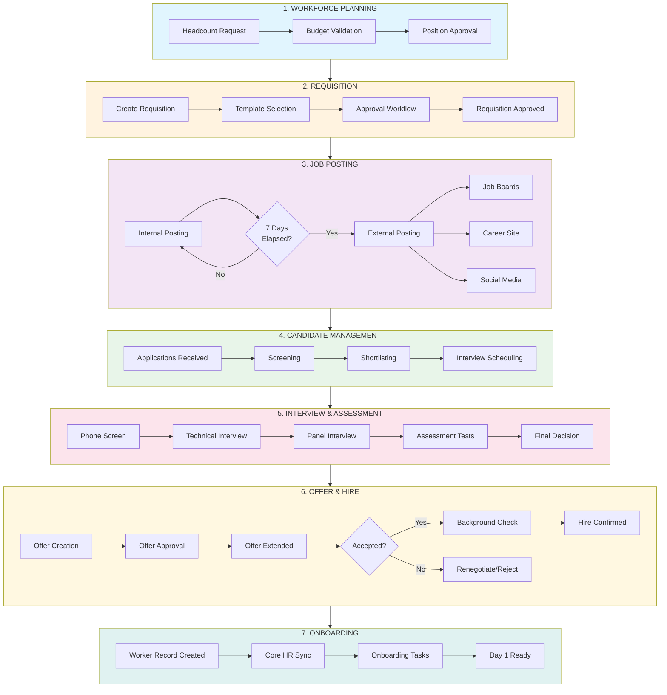
```mermaid
flowchart TB
    subgraph WP["1. WORKFORCE PLANNING"]
        WP1[Headcount Request] --> WP2[Budget Validation]
        WP2 --> WP3[Position Approval]
    end

    subgraph REQ["2. REQUISITION"]
        REQ1[Create Requisition] --> REQ2[Template Selection]
        REQ2 --> REQ3[Approval Workflow]
        REQ3 --> REQ4[Requisition Approved]
    end

    subgraph POST["3. JOB POSTING"]
        POST1[Internal Posting] --> POST2{7 Days<br/>Elapsed?}
        POST2 -->|No| POST1
        POST2 -->|Yes| POST3[External Posting]
        POST3 --> POST4[Job Boards]
        POST3 --> POST5[Career Site]
        POST3 --> POST6[Social Media]
    end

    subgraph CAND["4. CANDIDATE MANAGEMENT"]
        CAND1[Applications Received] --> CAND2[Screening]
        CAND2 --> CAND3[Shortlisting]
        CAND3 --> CAND4[Interview Scheduling]
    end

    subgraph INT["5. INTERVIEW & ASSESSMENT"]
        INT1[Phone Screen] --> INT2[Technical Interview]
        INT2 --> INT3[Panel Interview]
        INT3 --> INT4[Assessment Tests]
        INT4 --> INT5[Final Decision]
    end

    subgraph OFFER["6. OFFER & HIRE"]
        OFFER1[Offer Creation] --> OFFER2[Offer Approval]
        OFFER2 --> OFFER3[Offer Extended]
        OFFER3 --> OFFER4{Accepted?}
        OFFER4 -->|Yes| OFFER5[Background Check]
        OFFER4 -->|No| OFFER6[Renegotiate/Reject]
        OFFER5 --> OFFER7[Hire Confirmed]
    end

    subgraph ONBOARD["7. ONBOARDING"]
        ONB1[Worker Record Created] --> ONB2[Core HR Sync]
        ONB2 --> ONB3[Onboarding Tasks]
        ONB3 --> ONB4[Day 1 Ready]
    end

    WP --> REQ
    REQ --> POST
    POST --> CAND
    CAND --> INT
    INT --> OFFER
    OFFER --> ONBOARD

    style WP fill:#e1f5fe
    style REQ fill:#fff3e0
    style POST fill:#f3e5f5
    style CAND fill:#e8f5e9
    style INT fill:#fce4ec
    style OFFER fill:#fff8e1
    style ONBOARD fill:#e0f2f1
```

### 1.2 High-Level Swimlane Overview

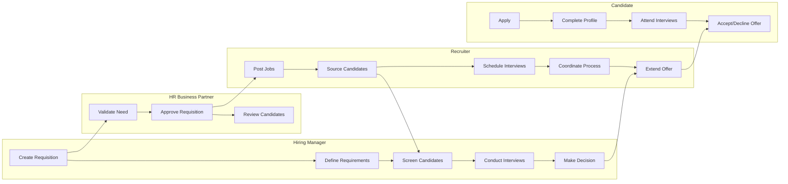
```mermaid
flowchart LR
    subgraph HR["HR Business Partner"]
        H1[Validate Need] --> H2[Approve Requisition]
        H2 --> H3[Review Candidates]
    end

    subgraph HM["Hiring Manager"]
        M1[Create Requisition] --> M2[Define Requirements]
        M2 --> M3[Screen Candidates]
        M3 --> M4[Conduct Interviews]
        M4 --> M5[Make Decision]
    end

    subgraph REC["Recruiter"]
        R1[Post Jobs] --> R2[Source Candidates]
        R2 --> R3[Schedule Interviews]
        R3 --> R4[Coordinate Process]
        R4 --> R5[Extend Offer]
    end

    subgraph CAND["Candidate"]
        C1[Apply] --> C2[Complete Profile]
        C2 --> C3[Attend Interviews]
        C3 --> C4[Accept/Decline Offer]
    end

    M1 --> H1
    H2 --> R1
    R2 --> M3
    M5 --> R5
    R5 --> C4
```

---

## 2. Requisition Workflows

### 2.1 Requisition Creation Flow

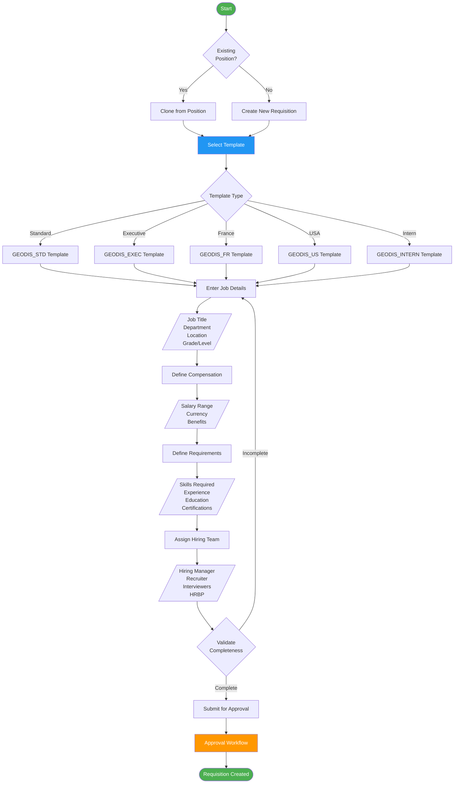
```mermaid
flowchart TD
    START([Start]) --> CHECK{Existing<br/>Position?}

    CHECK -->|Yes| CLONE[Clone from Position]
    CHECK -->|No| NEW[Create New Requisition]

    CLONE --> TEMPLATE
    NEW --> TEMPLATE[Select Template]

    TEMPLATE --> T1{Template Type}
    T1 -->|Standard| GEODIS_STD[GEODIS_STD Template]
    T1 -->|Executive| GEODIS_EXEC[GEODIS_EXEC Template]
    T1 -->|France| GEODIS_FR[GEODIS_FR Template]
    T1 -->|USA| GEODIS_US[GEODIS_US Template]
    T1 -->|Intern| GEODIS_INTERN[GEODIS_INTERN Template]

    GEODIS_STD --> DETAILS
    GEODIS_EXEC --> DETAILS
    GEODIS_FR --> DETAILS
    GEODIS_US --> DETAILS
    GEODIS_INTERN --> DETAILS

    DETAILS[Enter Job Details]
    DETAILS --> JOB_INFO[/"Job Title<br/>Department<br/>Location<br/>Grade/Level"/]

    JOB_INFO --> COMP[Define Compensation]
    COMP --> COMP_INFO[/"Salary Range<br/>Currency<br/>Benefits"/]

    COMP_INFO --> REQS[Define Requirements]
    REQS --> REQ_INFO[/"Skills Required<br/>Experience<br/>Education<br/>Certifications"/]

    REQ_INFO --> TEAM[Assign Hiring Team]
    TEAM --> TEAM_INFO[/"Hiring Manager<br/>Recruiter<br/>Interviewers<br/>HRBP"/]

    TEAM_INFO --> VALIDATE{Validate<br/>Completeness}
    VALIDATE -->|Incomplete| DETAILS
    VALIDATE -->|Complete| SUBMIT[Submit for Approval]

    SUBMIT --> APPROVAL[Approval Workflow]
    APPROVAL --> END([Requisition Created])

    style START fill:#4caf50,color:#fff
    style END fill:#4caf50,color:#fff
    style TEMPLATE fill:#2196f3,color:#fff
    style APPROVAL fill:#ff9800,color:#fff
```

### 2.2 Requisition Approval Workflow

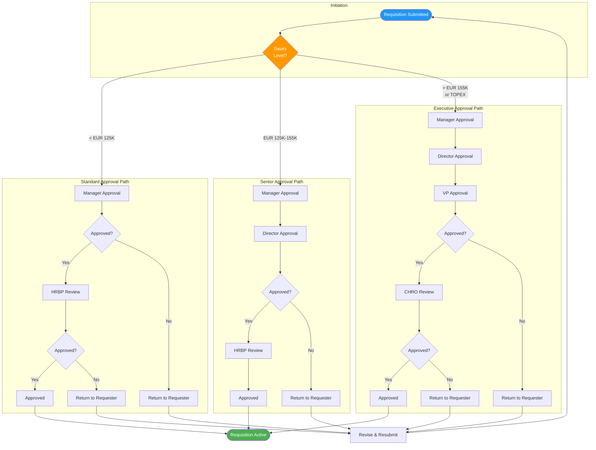
```mermaid
flowchart TD
    subgraph INIT["Initiation"]
        START([Requisition Submitted]) --> CHECK_SAL{Salary<br/>Level?}
    end

    subgraph STD["Standard Approval Path"]
        CHECK_SAL -->|< EUR 125K| MGR[Manager Approval]
        MGR --> MGR_DEC{Approved?}
        MGR_DEC -->|Yes| HR_STD[HRBP Review]
        MGR_DEC -->|No| REJECT1[Return to Requester]
        HR_STD --> HR_DEC{Approved?}
        HR_DEC -->|Yes| APPROVED_STD[Approved]
        HR_DEC -->|No| REJECT2[Return to Requester]
    end

    subgraph SENIOR["Senior Approval Path"]
        CHECK_SAL -->|EUR 125K-155K| MGR2[Manager Approval]
        MGR2 --> DIR[Director Approval]
        DIR --> DIR_DEC{Approved?}
        DIR_DEC -->|Yes| HR_SR[HRBP Review]
        DIR_DEC -->|No| REJECT3[Return to Requester]
        HR_SR --> APPROVED_SR[Approved]
    end

    subgraph EXEC["Executive Approval Path"]
        CHECK_SAL -->|> EUR 155K<br/>or TOPEX| MGR3[Manager Approval]
        MGR3 --> DIR2[Director Approval]
        DIR2 --> VP[VP Approval]
        VP --> VP_DEC{Approved?}
        VP_DEC -->|Yes| CHRO[CHRO Review]
        VP_DEC -->|No| REJECT4[Return to Requester]
        CHRO --> CHRO_DEC{Approved?}
        CHRO_DEC -->|Yes| APPROVED_EXEC[Approved]
        CHRO_DEC -->|No| REJECT5[Return to Requester]
    end

    APPROVED_STD --> ACTIVE([Requisition Active])
    APPROVED_SR --> ACTIVE
    APPROVED_EXEC --> ACTIVE

    REJECT1 --> REVISE[Revise & Resubmit]
    REJECT2 --> REVISE
    REJECT3 --> REVISE
    REJECT4 --> REVISE
    REJECT5 --> REVISE
    REVISE --> START

    style START fill:#2196f3,color:#fff
    style ACTIVE fill:#4caf50,color:#fff
    style CHECK_SAL fill:#ff9800,color:#fff
```

### 2.3 Requisition Status State Machine

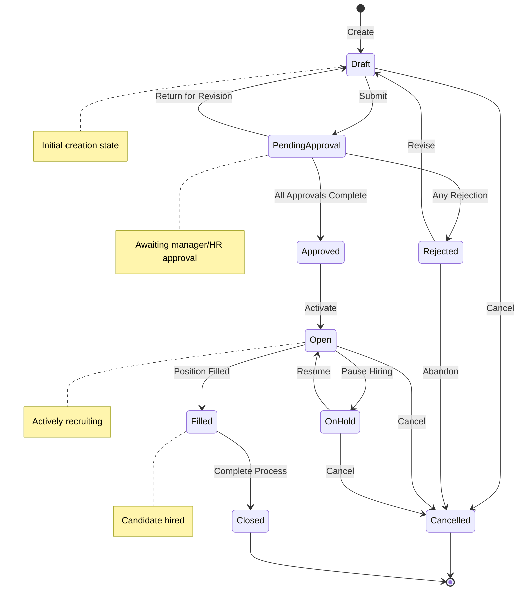
```mermaid
stateDiagram-v2
    [*] --> Draft: Create

    Draft --> PendingApproval: Submit
    Draft --> Cancelled: Cancel

    PendingApproval --> Approved: All Approvals Complete
    PendingApproval --> Rejected: Any Rejection
    PendingApproval --> Draft: Return for Revision

    Rejected --> Draft: Revise
    Rejected --> Cancelled: Abandon

    Approved --> Open: Activate

    Open --> OnHold: Pause Hiring
    Open --> Filled: Position Filled
    Open --> Cancelled: Cancel

    OnHold --> Open: Resume
    OnHold --> Cancelled: Cancel

    Filled --> Closed: Complete Process
    Cancelled --> [*]
    Closed --> [*]

    note right of Draft: Initial creation state
    note right of PendingApproval: Awaiting manager/HR approval
    note right of Open: Actively recruiting
    note right of Filled: Candidate hired
```

### 2.4 Headcount Planning Integration

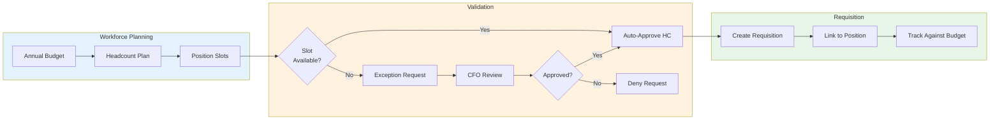
```mermaid
flowchart LR
    subgraph WFP["Workforce Planning"]
        BUDGET[Annual Budget] --> HC_PLAN[Headcount Plan]
        HC_PLAN --> POSITIONS[Position Slots]
    end

    subgraph VALIDATION["Validation"]
        POSITIONS --> CHECK{Slot<br/>Available?}
        CHECK -->|Yes| APPROVE[Auto-Approve HC]
        CHECK -->|No| EXCEPTION[Exception Request]
        EXCEPTION --> CFO_REV[CFO Review]
        CFO_REV --> CFO_DEC{Approved?}
        CFO_DEC -->|Yes| APPROVE
        CFO_DEC -->|No| DENY[Deny Request]
    end

    subgraph REQUISITION["Requisition"]
        APPROVE --> CREATE[Create Requisition]
        CREATE --> LINK[Link to Position]
        LINK --> TRACK[Track Against Budget]
    end

    style WFP fill:#e3f2fd
    style VALIDATION fill:#fff3e0
    style REQUISITION fill:#e8f5e9
```

---

## 3. Job Posting & Sourcing

### 3.1 Internal-First Posting Flow

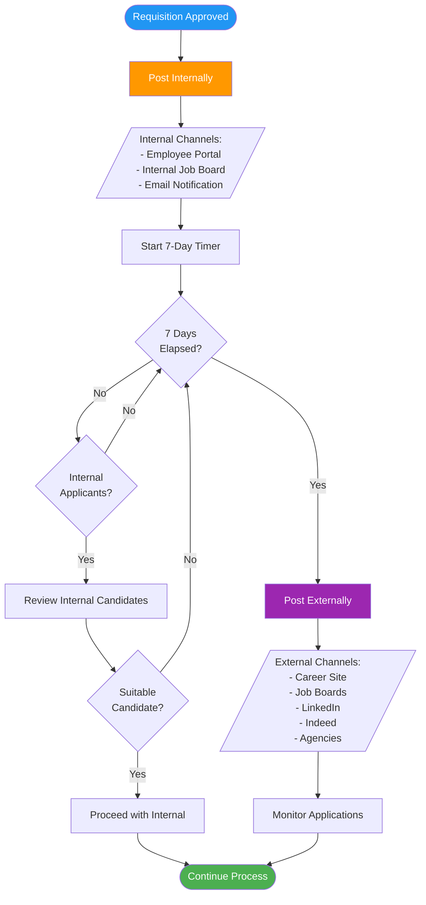
```mermaid
flowchart TD
    START([Requisition Approved]) --> INT_POST[Post Internally]

    INT_POST --> CHANNELS1[/"Internal Channels:<br/>- Employee Portal<br/>- Internal Job Board<br/>- Email Notification"/]

    CHANNELS1 --> TIMER[Start 7-Day Timer]

    TIMER --> WAIT{7 Days<br/>Elapsed?}

    WAIT -->|No| CHECK_INT{Internal<br/>Applicants?}
    CHECK_INT -->|Yes| REVIEW_INT[Review Internal Candidates]
    CHECK_INT -->|No| WAIT

    REVIEW_INT --> SUITABLE{Suitable<br/>Candidate?}
    SUITABLE -->|Yes| PROCEED_INT[Proceed with Internal]
    SUITABLE -->|No| WAIT

    WAIT -->|Yes| EXT_POST[Post Externally]

    EXT_POST --> CHANNELS2[/"External Channels:<br/>- Career Site<br/>- Job Boards<br/>- LinkedIn<br/>- Indeed<br/>- Agencies"/]

    CHANNELS2 --> MONITOR[Monitor Applications]

    PROCEED_INT --> END([Continue Process])
    MONITOR --> END

    style START fill:#2196f3,color:#fff
    style END fill:#4caf50,color:#fff
    style INT_POST fill:#ff9800,color:#fff
    style EXT_POST fill:#9c27b0,color:#fff
```

### 3.2 Multi-Channel Posting Distribution

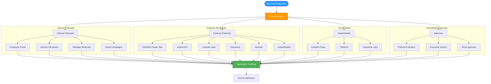
```mermaid
flowchart TD
    REQ([Approved Requisition]) --> POSTING[Posting Engine]

    POSTING --> INT[Internal Channels]
    POSTING --> EXT[External Channels]
    POSTING --> SOCIAL[Social Media]
    POSTING --> AGENCY[Agencies]

    subgraph INTERNAL["Internal Channels"]
        INT --> INT1[Employee Portal]
        INT --> INT2[Internal Job Board]
        INT --> INT3[Manager Referrals]
        INT --> INT4[Email Campaigns]
    end

    subgraph EXTERNAL["External Job Boards"]
        EXT --> EXT1[GEODIS Career Site]
        EXT --> EXT2[Indeed API]
        EXT --> EXT3[LinkedIn Jobs]
        EXT --> EXT4[Glassdoor]
        EXT --> EXT5[Monster]
        EXT --> EXT6[CareerBuilder]
    end

    subgraph SOCIAL_MEDIA["Social Media"]
        SOCIAL --> SOC1[LinkedIn Posts]
        SOCIAL --> SOC2[Twitter/X]
        SOCIAL --> SOC3[Facebook Jobs]
    end

    subgraph AGENCIES["Recruitment Agencies"]
        AGENCY --> AG1[Preferred Vendors]
        AGENCY --> AG2[Executive Search]
        AGENCY --> AG3[Temp Agencies]
    end

    INT1 --> TRACK[Application Tracking]
    INT2 --> TRACK
    INT3 --> TRACK
    INT4 --> TRACK
    EXT1 --> TRACK
    EXT2 --> TRACK
    EXT3 --> TRACK
    EXT4 --> TRACK
    EXT5 --> TRACK
    EXT6 --> TRACK
    SOC1 --> TRACK
    SOC2 --> TRACK
    SOC3 --> TRACK
    AG1 --> TRACK
    AG2 --> TRACK
    AG3 --> TRACK

    TRACK --> SOURCE[Source Attribution]

    style REQ fill:#2196f3,color:#fff
    style POSTING fill:#ff9800,color:#fff
    style TRACK fill:#4caf50,color:#fff
```

### 3.3 Job Board Integration Flow

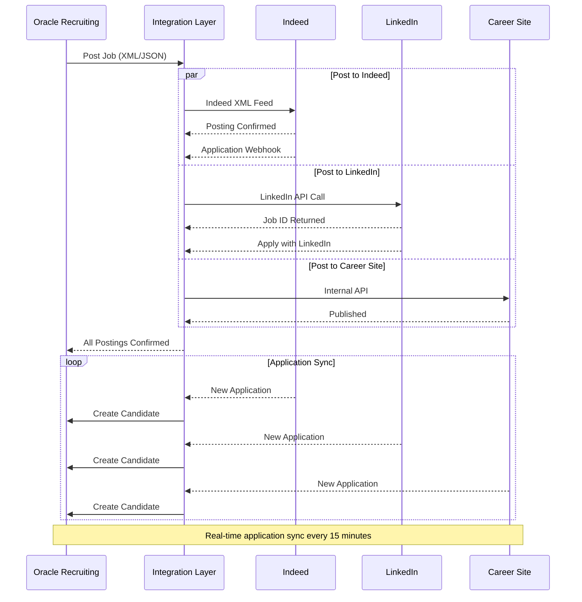
```mermaid
sequenceDiagram
    participant ORC as Oracle Recruiting
    participant API as Integration Layer
    participant IND as Indeed
    participant LI as LinkedIn
    participant CS as Career Site

    ORC->>API: Post Job (XML/JSON)

    par Post to Indeed
        API->>IND: Indeed XML Feed
        IND-->>API: Posting Confirmed
        IND-->>API: Application Webhook
    and Post to LinkedIn
        API->>LI: LinkedIn API Call
        LI-->>API: Job ID Returned
        LI-->>API: Apply with LinkedIn
    and Post to Career Site
        API->>CS: Internal API
        CS-->>API: Published
    end

    API-->>ORC: All Postings Confirmed

    loop Application Sync
        IND-->>API: New Application
        API->>ORC: Create Candidate
        LI-->>API: New Application
        API->>ORC: Create Candidate
        CS-->>API: New Application
        API->>ORC: Create Candidate
    end

    Note over ORC,CS: Real-time application sync every 15 minutes
```

### 3.4 Source Attribution Tracking

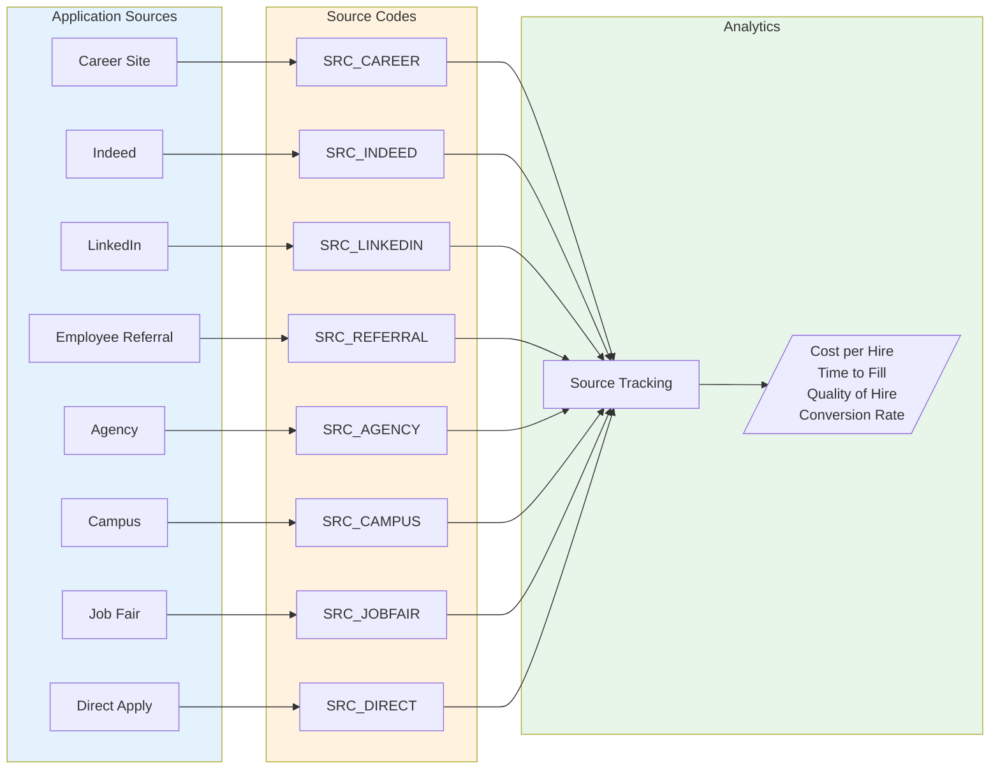
```mermaid
flowchart LR
    subgraph SOURCES["Application Sources"]
        S1[Career Site]
        S2[Indeed]
        S3[LinkedIn]
        S4[Employee Referral]
        S5[Agency]
        S6[Campus]
        S7[Job Fair]
        S8[Direct Apply]
    end

    subgraph CODES["Source Codes"]
        S1 --> C1[SRC_CAREER]
        S2 --> C2[SRC_INDEED]
        S3 --> C3[SRC_LINKEDIN]
        S4 --> C4[SRC_REFERRAL]
        S5 --> C5[SRC_AGENCY]
        S6 --> C6[SRC_CAMPUS]
        S7 --> C7[SRC_JOBFAIR]
        S8 --> C8[SRC_DIRECT]
    end

    subgraph ANALYTICS["Analytics"]
        C1 --> TRACK[Source Tracking]
        C2 --> TRACK
        C3 --> TRACK
        C4 --> TRACK
        C5 --> TRACK
        C6 --> TRACK
        C7 --> TRACK
        C8 --> TRACK

        TRACK --> METRICS[/"Cost per Hire<br/>Time to Fill<br/>Quality of Hire<br/>Conversion Rate"/]
    end

    style SOURCES fill:#e3f2fd
    style CODES fill:#fff3e0
    style ANALYTICS fill:#e8f5e9
```

---

## 4. Candidate Pipeline

### 4.1 Complete 12-Phase Candidate Journey

```mermaid
flowchart TD
    subgraph P1["Phase 1: NEW"]
        NEW[New Application] --> NEW_S1[New - Pending Review]
        NEW_S1 --> NEW_S2[New - Under Consideration]
    end

    subgraph P2["Phase 2: SCREENING"]
        NEW_S2 --> SCR[Screening]
        SCR --> SCR_S1[Phone Screen Scheduled]
        SCR_S1 --> SCR_S2[Phone Screen Completed]
        SCR_S2 --> SCR_S3[Screening Passed]
    end

    subgraph P3["Phase 3: ASSESSMENT"]
        SCR_S3 --> ASS[Assessment]
        ASS --> ASS_S1[Assessment Invited]
        ASS_S1 --> ASS_S2[Assessment In Progress]
        ASS_S2 --> ASS_S3[Assessment Completed]
        ASS_S3 --> ASS_S4[Assessment Passed]
    end

    subgraph P4["Phase 4: INTERVIEW"]
        ASS_S4 --> INT[Interview]
        INT --> INT_S1[Interview Scheduled]
        INT_S1 --> INT_S2[Interview Completed]
        INT_S2 --> INT_S3[Interview Passed]
    end

    subgraph P5["Phase 5: MANAGER REVIEW"]
        INT_S3 --> MGR[Manager Review]
        MGR --> MGR_S1[Pending Manager Decision]
        MGR_S1 --> MGR_S2[Manager Approved]
    end

    subgraph P6["Phase 6: OFFER"]
        MGR_S2 --> OFF[Offer]
        OFF --> OFF_S1[Offer Pending Approval]
        OFF_S1 --> OFF_S2[Offer Approved]
        OFF_S2 --> OFF_S3[Offer Extended]
        OFF_S3 --> OFF_S4[Offer Accepted]
    end

    subgraph P7["Phase 7: BACKGROUND"]
        OFF_S4 --> BG[Background Check]
        BG --> BG_S1[Background Initiated]
        BG_S1 --> BG_S2[Background In Progress]
        BG_S2 --> BG_S3[Background Cleared]
    end

    subgraph P8["Phase 8: HR PROCESSING"]
        BG_S3 --> HRP[HR Processing]
        HRP --> HRP_S1[Documents Requested]
        HRP_S1 --> HRP_S2[Documents Received]
        HRP_S2 --> HRP_S3[HR Review Complete]
    end

    subgraph P9["Phase 9: PRE-HIRE"]
        HRP_S3 --> PRE[Pre-Hire]
        PRE --> PRE_S1[Pre-Hire Tasks Assigned]
        PRE_S1 --> PRE_S2[Pre-Hire Complete]
    end

    subgraph P10["Phase 10: HIRE"]
        PRE_S2 --> HIRE[Hire]
        HIRE --> HIRE_S1[Hire Confirmed]
        HIRE_S1 --> HIRE_S2[Start Date Set]
    end

    subgraph P11["Phase 11: ONBOARDING"]
        HIRE_S2 --> ONB[Onboarding]
        ONB --> ONB_S1[Onboarding Initiated]
        ONB_S1 --> ONB_S2[Day 1 Complete]
    end

    subgraph P12["Phase 12: COMPLETE"]
        ONB_S2 --> COMP[Complete]
        COMP --> COMP_S1[Probation Started]
        COMP_S1 --> COMP_S2[Hire Complete]
    end

    style P1 fill:#e3f2fd
    style P2 fill:#e1f5fe
    style P3 fill:#b3e5fc
    style P4 fill:#81d4fa
    style P5 fill:#4fc3f7
    style P6 fill:#29b6f6
    style P7 fill:#03a9f4
    style P8 fill:#039be5
    style P9 fill:#0288d1
    style P10 fill:#0277bd
    style P11 fill:#01579b
    style P12 fill:#004d40
```

### 4.2 Candidate State Machine

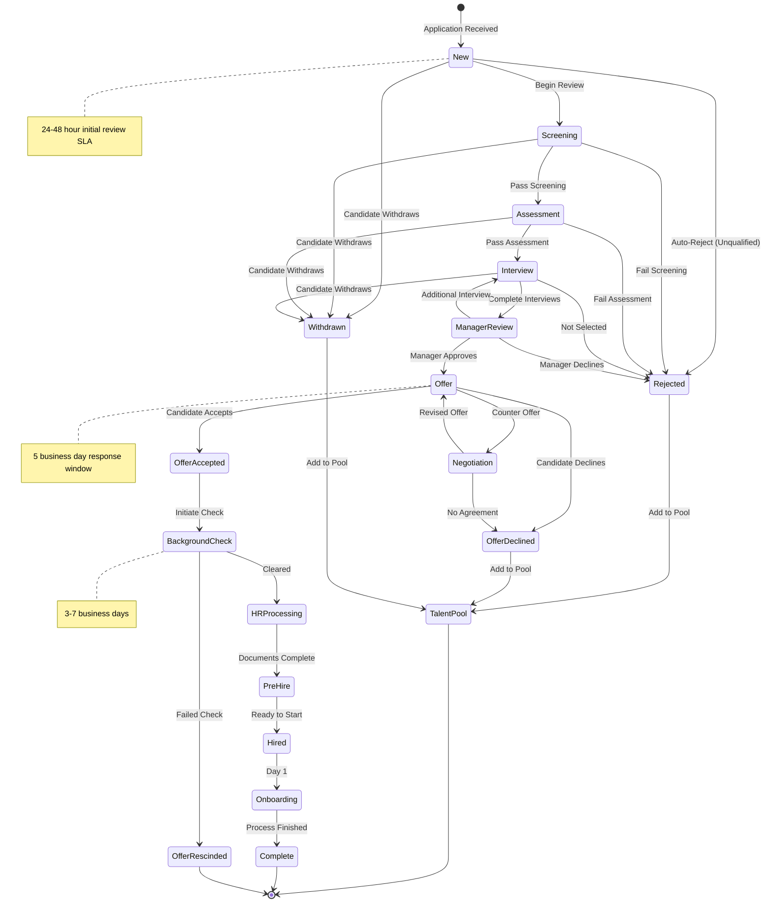
```mermaid
stateDiagram-v2
    [*] --> New: Application Received

    New --> Screening: Begin Review
    New --> Rejected: Auto-Reject (Unqualified)
    New --> Withdrawn: Candidate Withdraws

    Screening --> Assessment: Pass Screening
    Screening --> Rejected: Fail Screening
    Screening --> Withdrawn: Candidate Withdraws

    Assessment --> Interview: Pass Assessment
    Assessment --> Rejected: Fail Assessment
    Assessment --> Withdrawn: Candidate Withdraws

    Interview --> ManagerReview: Complete Interviews
    Interview --> Rejected: Not Selected
    Interview --> Withdrawn: Candidate Withdraws

    ManagerReview --> Offer: Manager Approves
    ManagerReview --> Interview: Additional Interview
    ManagerReview --> Rejected: Manager Declines

    Offer --> OfferAccepted: Candidate Accepts
    Offer --> OfferDeclined: Candidate Declines
    Offer --> Negotiation: Counter Offer

    Negotiation --> Offer: Revised Offer
    Negotiation --> OfferDeclined: No Agreement

    OfferAccepted --> BackgroundCheck: Initiate Check

    BackgroundCheck --> HRProcessing: Cleared
    BackgroundCheck --> OfferRescinded: Failed Check

    HRProcessing --> PreHire: Documents Complete

    PreHire --> Hired: Ready to Start

    Hired --> Onboarding: Day 1

    Onboarding --> Complete: Process Finished

    Rejected --> TalentPool: Add to Pool
    OfferDeclined --> TalentPool: Add to Pool
    Withdrawn --> TalentPool: Add to Pool

    TalentPool --> [*]
    Complete --> [*]
    OfferRescinded --> [*]

    note right of New: 24-48 hour initial review SLA
    note right of Offer: 5 business day response window
    note right of BackgroundCheck: 3-7 business days
```

### 4.3 Candidate Screening Workflow

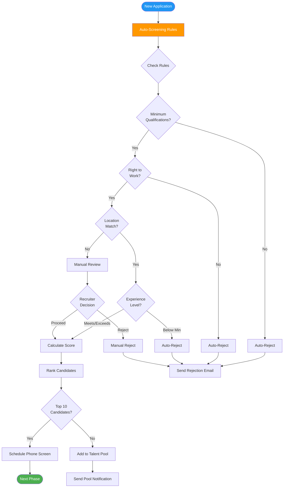
```mermaid
flowchart TD
    START([New Application]) --> AUTO[Auto-Screening Rules]

    AUTO --> RULES{Check Rules}

    RULES --> R1{Minimum<br/>Qualifications?}
    R1 -->|No| REJECT1[Auto-Reject]
    R1 -->|Yes| R2{Right to<br/>Work?}

    R2 -->|No| REJECT2[Auto-Reject]
    R2 -->|Yes| R3{Location<br/>Match?}

    R3 -->|No| REVIEW1[Manual Review]
    R3 -->|Yes| R4{Experience<br/>Level?}

    R4 -->|Below Min| REJECT3[Auto-Reject]
    R4 -->|Meets/Exceeds| SCORE[Calculate Score]

    REVIEW1 --> REC_DEC{Recruiter<br/>Decision}
    REC_DEC -->|Proceed| SCORE
    REC_DEC -->|Reject| REJECT4[Manual Reject]

    SCORE --> RANK[Rank Candidates]
    RANK --> SHORTLIST{Top 10<br/>Candidates?}

    SHORTLIST -->|Yes| PHONE[Schedule Phone Screen]
    SHORTLIST -->|No| TALENT[Add to Talent Pool]

    PHONE --> NEXT([Next Phase])

    REJECT1 --> NOTIFY[Send Rejection Email]
    REJECT2 --> NOTIFY
    REJECT3 --> NOTIFY
    REJECT4 --> NOTIFY
    TALENT --> NOTIFY2[Send Pool Notification]

    style START fill:#2196f3,color:#fff
    style NEXT fill:#4caf50,color:#fff
    style AUTO fill:#ff9800,color:#fff
```

### 4.4 Duplicate Candidate Detection

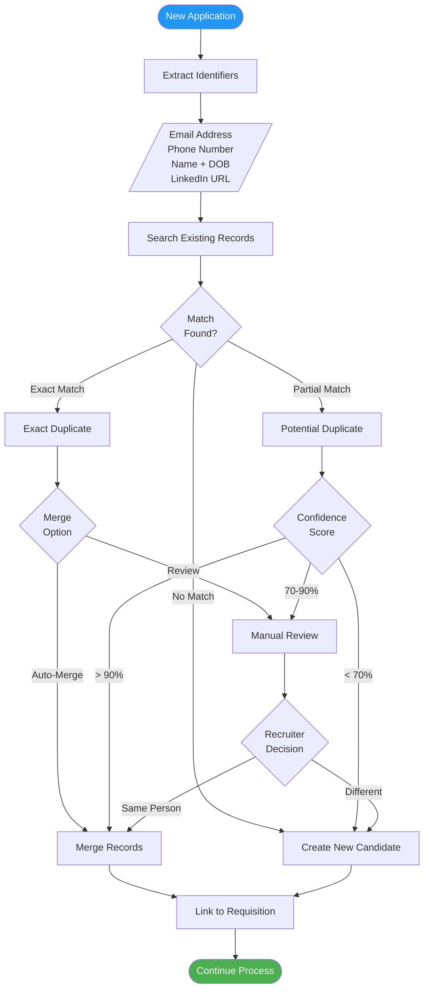
```mermaid
flowchart TD
    NEW([New Application]) --> EXTRACT[Extract Identifiers]

    EXTRACT --> ID[/"Email Address<br/>Phone Number<br/>Name + DOB<br/>LinkedIn URL"/]

    ID --> SEARCH[Search Existing Records]

    SEARCH --> MATCH{Match<br/>Found?}

    MATCH -->|No Match| CREATE[Create New Candidate]

    MATCH -->|Exact Match| EXACT[Exact Duplicate]
    EXACT --> MERGE_OPT{Merge<br/>Option}
    MERGE_OPT -->|Auto-Merge| AUTO_MERGE[Merge Records]
    MERGE_OPT -->|Review| MANUAL[Manual Review]

    MATCH -->|Partial Match| PARTIAL[Potential Duplicate]
    PARTIAL --> CONFIDENCE{Confidence<br/>Score}
    CONFIDENCE -->|> 90%| AUTO_MERGE
    CONFIDENCE -->|70-90%| MANUAL
    CONFIDENCE -->|< 70%| CREATE

    MANUAL --> REC_DEC{Recruiter<br/>Decision}
    REC_DEC -->|Same Person| AUTO_MERGE
    REC_DEC -->|Different| CREATE

    AUTO_MERGE --> LINK[Link to Requisition]
    CREATE --> LINK

    LINK --> PROCEED([Continue Process])

    style NEW fill:#2196f3,color:#fff
    style PROCEED fill:#4caf50,color:#fff
```

---

## 5. Interview & Assessment

### 5.1 Interview Scheduling Flow

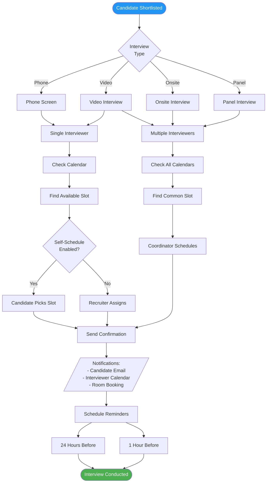
```mermaid
flowchart TD
    START([Candidate Shortlisted]) --> TYPE{Interview<br/>Type}

    TYPE -->|Phone| PHONE[Phone Screen]
    TYPE -->|Video| VIDEO[Video Interview]
    TYPE -->|Onsite| ONSITE[Onsite Interview]
    TYPE -->|Panel| PANEL[Panel Interview]

    PHONE --> SINGLE[Single Interviewer]
    VIDEO --> SINGLE
    VIDEO --> MULTI[Multiple Interviewers]
    ONSITE --> MULTI
    PANEL --> MULTI

    SINGLE --> CAL1[Check Calendar]
    MULTI --> CAL2[Check All Calendars]

    CAL1 --> SLOT1[Find Available Slot]
    CAL2 --> SLOT2[Find Common Slot]

    SLOT1 --> SELF{Self-Schedule<br/>Enabled?}
    SLOT2 --> COORD[Coordinator Schedules]

    SELF -->|Yes| CAND_PICK[Candidate Picks Slot]
    SELF -->|No| REC_PICK[Recruiter Assigns]

    CAND_PICK --> CONFIRM[Send Confirmation]
    REC_PICK --> CONFIRM
    COORD --> CONFIRM

    CONFIRM --> NOTIFY[/"Notifications:<br/>- Candidate Email<br/>- Interviewer Calendar<br/>- Room Booking"/]

    NOTIFY --> REMIND[Schedule Reminders]
    REMIND --> R1[24 Hours Before]
    REMIND --> R2[1 Hour Before]

    R1 --> INTERVIEW([Interview Conducted])
    R2 --> INTERVIEW

    style START fill:#2196f3,color:#fff
    style INTERVIEW fill:#4caf50,color:#fff
```

### 5.2 Interview Feedback Collection

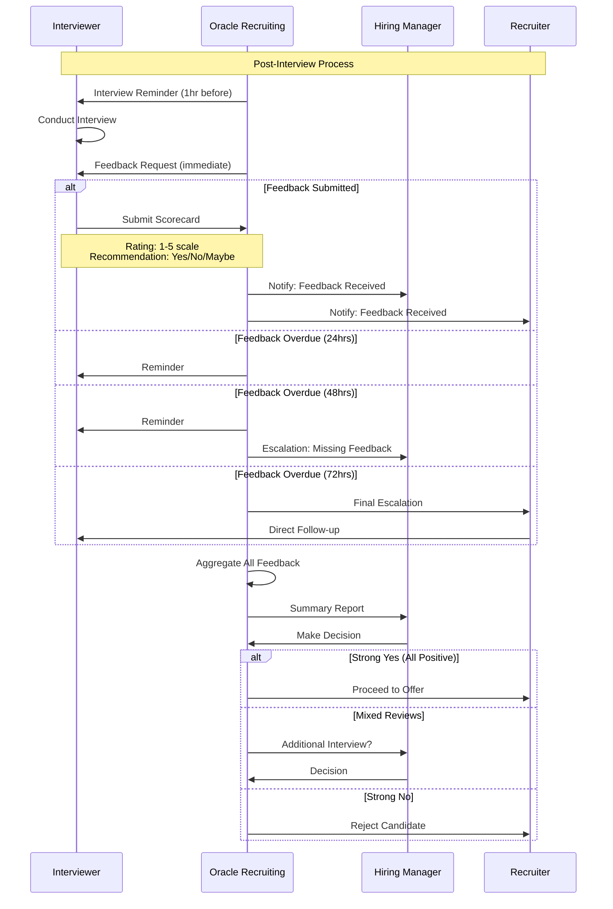
```mermaid
sequenceDiagram
    participant INT as Interviewer
    participant ORC as Oracle Recruiting
    participant HM as Hiring Manager
    participant REC as Recruiter

    Note over INT,REC: Post-Interview Process

    ORC->>INT: Interview Reminder (1hr before)
    INT->>INT: Conduct Interview

    ORC->>INT: Feedback Request (immediate)

    alt Feedback Submitted
        INT->>ORC: Submit Scorecard
        Note over INT,ORC: Rating: 1-5 scale<br/>Recommendation: Yes/No/Maybe
        ORC->>HM: Notify: Feedback Received
        ORC->>REC: Notify: Feedback Received
    else Feedback Overdue (24hrs)
        ORC->>INT: Reminder #1
    else Feedback Overdue (48hrs)
        ORC->>INT: Reminder #2
        ORC->>HM: Escalation: Missing Feedback
    else Feedback Overdue (72hrs)
        ORC->>REC: Final Escalation
        REC->>INT: Direct Follow-up
    end

    ORC->>ORC: Aggregate All Feedback
    ORC->>HM: Summary Report

    HM->>ORC: Make Decision

    alt Strong Yes (All Positive)
        ORC->>REC: Proceed to Offer
    else Mixed Reviews
        ORC->>HM: Additional Interview?
        HM->>ORC: Decision
    else Strong No
        ORC->>REC: Reject Candidate
    end
```

### 5.3 Assessment Test Flow

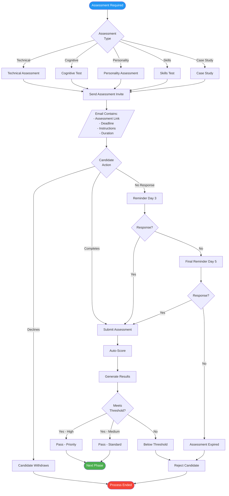
```mermaid
flowchart TD
    START([Assessment Required]) --> TYPE{Assessment<br/>Type}

    TYPE -->|Technical| TECH[Technical Assessment]
    TYPE -->|Cognitive| COG[Cognitive Test]
    TYPE -->|Personality| PERS[Personality Assessment]
    TYPE -->|Skills| SKILL[Skills Test]
    TYPE -->|Case Study| CASE[Case Study]

    TECH --> INVITE[Send Assessment Invite]
    COG --> INVITE
    PERS --> INVITE
    SKILL --> INVITE
    CASE --> INVITE

    INVITE --> EMAIL[/"Email Contains:<br/>- Assessment Link<br/>- Deadline<br/>- Instructions<br/>- Duration"/]

    EMAIL --> CAND_ACTION{Candidate<br/>Action}

    CAND_ACTION -->|Completes| SUBMIT[Submit Assessment]
    CAND_ACTION -->|No Response| REMIND1[Reminder Day 3]
    CAND_ACTION -->|Declines| WITHDRAW[Candidate Withdraws]

    REMIND1 --> CAND_ACTION2{Response?}
    CAND_ACTION2 -->|Yes| SUBMIT
    CAND_ACTION2 -->|No| REMIND2[Final Reminder Day 5]

    REMIND2 --> CAND_ACTION3{Response?}
    CAND_ACTION3 -->|Yes| SUBMIT
    CAND_ACTION3 -->|No| EXPIRE[Assessment Expired]

    SUBMIT --> SCORE[Auto-Score]
    SCORE --> RESULTS[Generate Results]

    RESULTS --> THRESHOLD{Meets<br/>Threshold?}
    THRESHOLD -->|Yes - High| PASS_HIGH[Pass - Priority]
    THRESHOLD -->|Yes - Medium| PASS_MED[Pass - Standard]
    THRESHOLD -->|No| FAIL[Below Threshold]

    PASS_HIGH --> NEXT([Next Phase])
    PASS_MED --> NEXT
    FAIL --> REJECT[Reject Candidate]
    EXPIRE --> REJECT
    WITHDRAW --> END([Process Ended])
    REJECT --> END

    style START fill:#2196f3,color:#fff
    style NEXT fill:#4caf50,color:#fff
    style END fill:#f44336,color:#fff
```

### 5.4 Interview Panel Coordination

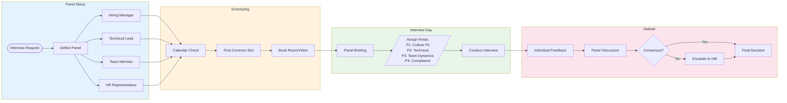
```mermaid
flowchart LR
    subgraph SETUP["Panel Setup"]
        REQ([Interview Request]) --> PANEL[Define Panel]
        PANEL --> P1[Hiring Manager]
        PANEL --> P2[Technical Lead]
        PANEL --> P3[Team Member]
        PANEL --> P4[HR Representative]
    end

    subgraph SCHEDULE["Scheduling"]
        P1 --> CAL[Calendar Check]
        P2 --> CAL
        P3 --> CAL
        P4 --> CAL
        CAL --> COMMON[Find Common Slot]
        COMMON --> BOOK[Book Room/Video]
    end

    subgraph CONDUCT["Interview Day"]
        BOOK --> BRIEF[Panel Briefing]
        BRIEF --> AREAS[/"Assign Areas:<br/>P1: Culture Fit<br/>P2: Technical<br/>P3: Team Dynamics<br/>P4: Compliance"/]
        AREAS --> INT[Conduct Interview]
    end

    subgraph DEBRIEF["Debrief"]
        INT --> FEEDBACK[Individual Feedback]
        FEEDBACK --> DISCUSS[Panel Discussion]
        DISCUSS --> CONSENSUS{Consensus?}
        CONSENSUS -->|Yes| DECISION[Final Decision]
        CONSENSUS -->|No| ESCALATE[Escalate to HM]
        ESCALATE --> DECISION
    end

    style SETUP fill:#e3f2fd
    style SCHEDULE fill:#fff3e0
    style CONDUCT fill:#e8f5e9
    style DEBRIEF fill:#fce4ec
```

---

## 6. Offer & Hire

### 6.1 Offer Creation & Approval Flow

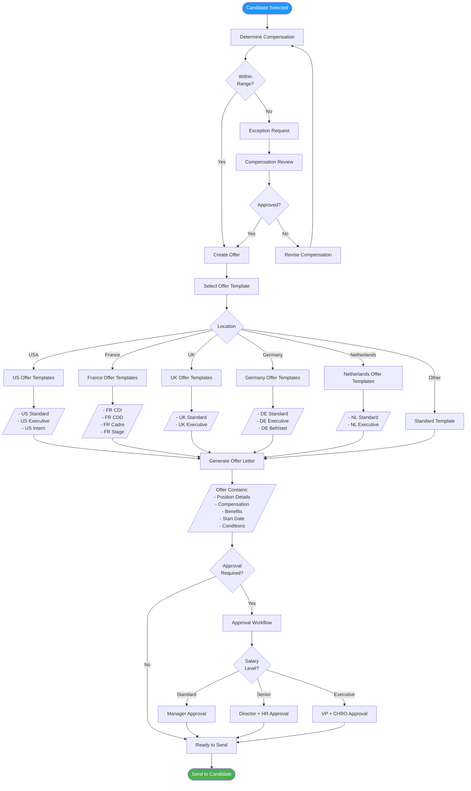
```mermaid
flowchart TD
    START([Candidate Selected]) --> COMP[Determine Compensation]

    COMP --> RANGE{Within<br/>Range?}
    RANGE -->|Yes| CREATE[Create Offer]
    RANGE -->|No| EXCEPTION[Exception Request]

    EXCEPTION --> COMP_REV[Compensation Review]
    COMP_REV --> COMP_DEC{Approved?}
    COMP_DEC -->|Yes| CREATE
    COMP_DEC -->|No| REVISE[Revise Compensation]
    REVISE --> COMP

    CREATE --> TEMPLATE[Select Offer Template]

    TEMPLATE --> T1{Location}
    T1 -->|USA| USA[US Offer Templates]
    T1 -->|France| FR[France Offer Templates]
    T1 -->|UK| UK[UK Offer Templates]
    T1 -->|Germany| DE[Germany Offer Templates]
    T1 -->|Netherlands| NL[Netherlands Offer Templates]
    T1 -->|Other| OTHER[Standard Template]

    USA --> USA_T[/"- US Standard<br/>- US Executive<br/>- US Intern"/]
    FR --> FR_T[/"- FR CDI<br/>- FR CDD<br/>- FR Cadre<br/>- FR Stage"/]
    UK --> UK_T[/"- UK Standard<br/>- UK Executive"/]
    DE --> DE_T[/"- DE Standard<br/>- DE Executive<br/>- DE Befristet"/]
    NL --> NL_T[/"- NL Standard<br/>- NL Executive"/]

    USA_T --> GENERATE
    FR_T --> GENERATE
    UK_T --> GENERATE
    DE_T --> GENERATE
    NL_T --> GENERATE
    OTHER --> GENERATE[Generate Offer Letter]

    GENERATE --> CONTENT[/"Offer Contains:<br/>- Position Details<br/>- Compensation<br/>- Benefits<br/>- Start Date<br/>- Conditions"/]

    CONTENT --> APPROVE{Approval<br/>Required?}
    APPROVE -->|Yes| APPROVAL[Approval Workflow]
    APPROVE -->|No| READY[Ready to Send]

    APPROVAL --> CHECK_LEVEL{Salary<br/>Level?}
    CHECK_LEVEL -->|Standard| MGR_APP[Manager Approval]
    CHECK_LEVEL -->|Senior| DIR_APP[Director + HR Approval]
    CHECK_LEVEL -->|Executive| EXEC_APP[VP + CHRO Approval]

    MGR_APP --> READY
    DIR_APP --> READY
    EXEC_APP --> READY

    READY --> SEND([Send to Candidate])

    style START fill:#2196f3,color:#fff
    style SEND fill:#4caf50,color:#fff
```

### 6.2 Offer Response Handling

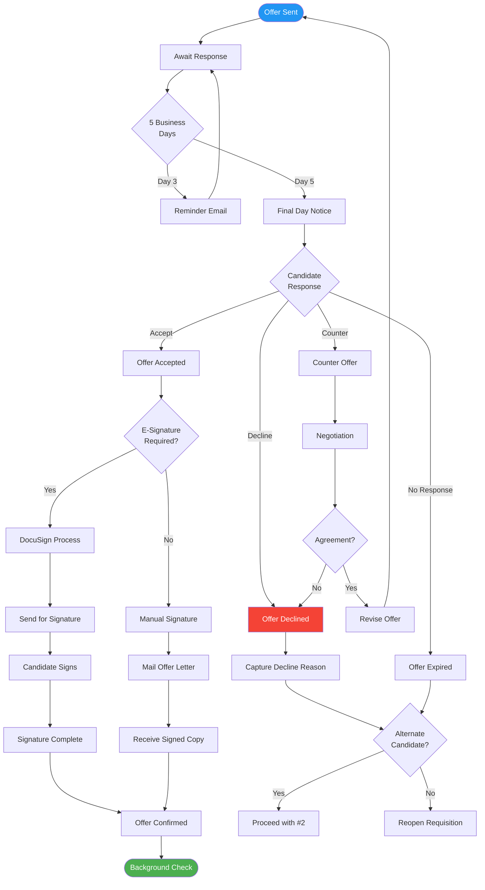
```mermaid
flowchart TD
    SENT([Offer Sent]) --> WAIT[Await Response]

    WAIT --> TIMER{5 Business<br/>Days}

    TIMER -->|Day 3| REMIND1[Reminder Email]
    REMIND1 --> WAIT

    TIMER -->|Day 5| FINAL[Final Day Notice]
    FINAL --> RESPONSE{Candidate<br/>Response}

    RESPONSE -->|Accept| ACCEPT[Offer Accepted]
    RESPONSE -->|Decline| DECLINE[Offer Declined]
    RESPONSE -->|Counter| COUNTER[Counter Offer]
    RESPONSE -->|No Response| EXPIRE[Offer Expired]

    ACCEPT --> SIGN{E-Signature<br/>Required?}
    SIGN -->|Yes| DOCUSIGN[DocuSign Process]
    SIGN -->|No| MANUAL_SIGN[Manual Signature]

    DOCUSIGN --> DS_SENT[Send for Signature]
    DS_SENT --> DS_SIGN[Candidate Signs]
    DS_SIGN --> DS_COMPLETE[Signature Complete]

    MANUAL_SIGN --> MAIL[Mail Offer Letter]
    MAIL --> RECEIVE[Receive Signed Copy]

    DS_COMPLETE --> CONFIRMED[Offer Confirmed]
    RECEIVE --> CONFIRMED

    DECLINE --> REASON[Capture Decline Reason]
    REASON --> ALTERNATE{Alternate<br/>Candidate?}
    ALTERNATE -->|Yes| NEXT_CAND[Proceed with #2]
    ALTERNATE -->|No| REOPEN[Reopen Requisition]

    COUNTER --> NEGOTIATE[Negotiation]
    NEGOTIATE --> NEG_DEC{Agreement?}
    NEG_DEC -->|Yes| REVISE_OFFER[Revise Offer]
    NEG_DEC -->|No| DECLINE
    REVISE_OFFER --> SENT

    EXPIRE --> ALTERNATE

    CONFIRMED --> BACKGROUND([Background Check])

    style SENT fill:#2196f3,color:#fff
    style BACKGROUND fill:#4caf50,color:#fff
    style DECLINE fill:#f44336,color:#fff
```

### 6.3 Background Check Process

```mermaid
flowchart TD
    START([Offer Accepted]) --> INIT[Initiate Background Check]

    INIT --> STERLING[Sterling Integration]

    STERLING --> CONSENT[Request Candidate Consent]
    CONSENT --> CAND_AUTH{Candidate<br/>Authorizes?}

    CAND_AUTH -->|Yes| SUBMIT[Submit to Sterling]
    CAND_AUTH -->|No| HOLD[Process On Hold]

    HOLD --> FOLLOWUP[Follow Up with Candidate]
    FOLLOWUP --> CAND_AUTH

    SUBMIT --> CHECKS[/"Background Checks:<br/>- Criminal History<br/>- Employment Verification<br/>- Education Verification<br/>- Reference Checks<br/>- Credit Check (if applicable)"/]

    CHECKS --> PROCESS[Processing 3-7 Days]

    PROCESS --> RESULTS{Results}

    RESULTS -->|All Clear| CLEAR[Background Cleared]
    RESULTS -->|Issues Found| REVIEW[HR Review Required]
    RESULTS -->|Incomplete| ADDITIONAL[Additional Info Needed]

    REVIEW --> HR_DEC{HR<br/>Decision}
    HR_DEC -->|Proceed| CLEAR
    HR_DEC -->|Concern| LEGAL[Legal Review]
    HR_DEC -->|Fail| RESCIND[Rescind Offer]

    LEGAL --> LEGAL_DEC{Legal<br/>Decision}
    LEGAL_DEC -->|Proceed| CLEAR
    LEGAL_DEC -->|Fail| RESCIND

    ADDITIONAL --> CAND_INFO[Candidate Provides Info]
    CAND_INFO --> PROCESS

    CLEAR --> PROCEED([Proceed to Hire])
    RESCIND --> NOTIFY[Notify Candidate]
    NOTIFY --> END([Process Ended])

    style START fill:#2196f3,color:#fff
    style PROCEED fill:#4caf50,color:#fff
    style END fill:#f44336,color:#fff
```

### 6.4 Hire to Core HR Flow

```mermaid
flowchart TD
    START([Background Cleared]) --> HR_PROC[HR Processing]

    HR_PROC --> DOCS[Collect Documents]
    DOCS --> DOC_LIST[/"Required Documents:<br/>- ID/Passport<br/>- Work Authorization<br/>- Tax Forms<br/>- Bank Details<br/>- Emergency Contact<br/>- Signed Policies"/]

    DOC_LIST --> VERIFY{All Docs<br/>Received?}
    VERIFY -->|No| REQUEST[Request Missing Docs]
    REQUEST --> VERIFY
    VERIFY -->|Yes| VALIDATE[Validate Documents]

    VALIDATE --> VALID{Documents<br/>Valid?}
    VALID -->|No| REJECT_DOC[Reject & Request New]
    REJECT_DOC --> VERIFY
    VALID -->|Yes| CREATE_WORKER[Create Worker Record]

    CREATE_WORKER --> ORACLE[Oracle Core HR]

    ORACLE --> WORKER[/"Worker Record:<br/>- Personal Info<br/>- Job Assignment<br/>- Compensation<br/>- Manager<br/>- Location<br/>- Cost Center"/]

    WORKER --> SYNC[Sync to Systems]

    SYNC --> S1[Payroll]
    SYNC --> S2[Benefits]
    SYNC --> S3[Time & Attendance]
    SYNC --> S4[Learning]
    SYNC --> S5[IT Provisioning]

    S1 --> READY{All Systems<br/>Ready?}
    S2 --> READY
    S3 --> READY
    S4 --> READY
    S5 --> READY

    READY -->|Yes| CONFIRM[Confirm Start Date]
    READY -->|No| RESOLVE[Resolve Issues]
    RESOLVE --> READY

    CONFIRM --> ONBOARD([Begin Onboarding])

    style START fill:#2196f3,color:#fff
    style ONBOARD fill:#4caf50,color:#fff
```

---

## 7. Integration Architecture

### 7.1 System Integration Overview

```mermaid
flowchart TB
    subgraph CORE["Oracle HCM Cloud"]
        IRC[Oracle Recruiting]
        HCM[Core HR]
        COMP[Compensation]
        BEN[Benefits]
        PAY[Payroll]
    end

    subgraph EXT["External Systems"]
        IND[Indeed]
        LI[LinkedIn]
        STER[Sterling]
        DOCU[DocuSign]
        CAL[Calendar Systems]
    end

    subgraph INT["Integration Layer"]
        OIC[Oracle Integration Cloud]
        API[REST APIs]
        FEED[XML Feeds]
    end

    subgraph MDM["Master Data"]
        EBX[EBX MDM]
        ORG[Organization Data]
        JOB[Job Data]
        LOC[Location Data]
    end

    IRC <--> OIC
    HCM <--> OIC
    COMP <--> OIC
    BEN <--> OIC
    PAY <--> OIC

    OIC <--> API
    OIC <--> FEED

    API <--> IND
    API <--> LI
    API <--> STER
    API <--> DOCU
    API <--> CAL

    EBX --> OIC
    ORG --> EBX
    JOB --> EBX
    LOC --> EBX

    style CORE fill:#e3f2fd
    style EXT fill:#fff3e0
    style INT fill:#e8f5e9
    style MDM fill:#fce4ec
```

### 7.2 Job Board Integration Detail

```mermaid
sequenceDiagram
    participant ORC as Oracle Recruiting
    participant OIC as Oracle Integration Cloud
    participant IND as Indeed API
    participant LI as LinkedIn API

    Note over ORC,LI: Job Posting Flow

    ORC->>OIC: New Job Posted (Event)
    OIC->>OIC: Transform to Partner Format

    par Post to Indeed
        OIC->>IND: POST /jobs (XML)
        IND-->>OIC: 201 Created (Job ID)
    and Post to LinkedIn
        OIC->>LI: POST /jobs (JSON)
        LI-->>OIC: 201 Created (Job URN)
    end

    OIC-->>ORC: Update External IDs

    Note over ORC,LI: Application Sync Flow (Every 15 min)

    loop Application Polling
        OIC->>IND: GET /applications?since={timestamp}
        IND-->>OIC: Application List
        OIC->>ORC: Create Candidates (Batch)

        OIC->>LI: GET /applications?since={timestamp}
        LI-->>OIC: Application List
        OIC->>ORC: Create Candidates (Batch)
    end

    Note over ORC,LI: Status Sync

    ORC->>OIC: Candidate Status Changed
    OIC->>IND: PUT /applications/{id}/status
    OIC->>LI: PUT /applications/{urn}/status
```

### 7.3 Sterling Background Check Integration

```mermaid
sequenceDiagram
    participant ORC as Oracle Recruiting
    participant OIC as Integration Cloud
    participant STER as Sterling API
    participant CAND as Candidate Portal

    Note over ORC,CAND: Initiation

    ORC->>OIC: Background Check Request
    OIC->>STER: POST /orders (Candidate Info)
    STER-->>OIC: Order ID
    OIC-->>ORC: Store Order Reference

    STER->>CAND: Email: Consent Request
    CAND->>STER: Candidate Provides Consent

    Note over ORC,CAND: Processing

    STER->>STER: Run Background Checks

    loop Status Updates
        OIC->>STER: GET /orders/{id}/status
        STER-->>OIC: Status Update
        OIC->>ORC: Update Candidate Status
    end

    Note over ORC,CAND: Completion

    STER-->>OIC: Webhook: Check Complete
    OIC->>STER: GET /orders/{id}/report
    STER-->>OIC: Full Report (PDF + JSON)
    OIC->>ORC: Update with Results
    OIC->>ORC: Attach Report Document

    alt Clear
        ORC->>ORC: Move to HR Processing
    else Issues Found
        ORC->>ORC: Flag for HR Review
    end
```

### 7.4 DocuSign E-Signature Integration

```mermaid
sequenceDiagram
    participant ORC as Oracle Recruiting
    participant OIC as Integration Cloud
    participant DS as DocuSign API
    participant CAND as Candidate

    Note over ORC,CAND: Offer Letter Signing

    ORC->>OIC: Send Offer for Signature
    OIC->>OIC: Generate Offer PDF
    OIC->>DS: POST /envelopes (PDF + Recipient)
    DS-->>OIC: Envelope ID
    OIC-->>ORC: Store Envelope Reference

    DS->>CAND: Email: Please Sign Offer

    alt Candidate Signs
        CAND->>DS: Open & Sign Document
        DS->>DS: Apply Digital Signature
        DS-->>OIC: Webhook: Envelope Completed
        OIC->>DS: GET /envelopes/{id}/documents
        DS-->>OIC: Signed PDF
        OIC->>ORC: Attach Signed Offer
        OIC->>ORC: Update Status: Accepted
    else Candidate Declines
        CAND->>DS: Decline to Sign
        DS-->>OIC: Webhook: Envelope Declined
        OIC->>ORC: Update Status: Declined
    else No Response (5 days)
        DS-->>OIC: Webhook: Envelope Expired
        OIC->>ORC: Update Status: Expired
    end
```

### 7.5 MDM/EBX Synchronization

```mermaid
flowchart LR
    subgraph EBX["EBX Master Data Hub"]
        ORG[Organization Structure]
        JOB[Job Catalog]
        LOC[Locations]
        GRADE[Grades & Bands]
        DEPT[Departments]
    end

    subgraph SYNC["Sync Process"]
        TRIGGER[Change Trigger]
        EXTRACT[Extract Changes]
        TRANSFORM[Transform Data]
        LOAD[Load to Target]
    end

    subgraph ORC["Oracle Recruiting"]
        ORC_ORG[Organizations]
        ORC_JOB[Job Requisitions]
        ORC_LOC[Work Locations]
        ORC_GRADE[Salary Grades]
        ORC_DEPT[Departments]
    end

    ORG --> TRIGGER
    JOB --> TRIGGER
    LOC --> TRIGGER
    GRADE --> TRIGGER
    DEPT --> TRIGGER

    TRIGGER --> EXTRACT
    EXTRACT --> TRANSFORM
    TRANSFORM --> LOAD

    LOAD --> ORC_ORG
    LOAD --> ORC_JOB
    LOAD --> ORC_LOC
    LOAD --> ORC_GRADE
    LOAD --> ORC_DEPT

    style EBX fill:#e3f2fd
    style SYNC fill:#fff3e0
    style ORC fill:#e8f5e9
```

---

## 8. Governance & Approvals

### 8.1 RACI Matrix Visualization

```mermaid
flowchart TD
    subgraph PROCESS["Recruitment Process Steps"]
        P1[1. Requisition Creation]
        P2[2. Requisition Approval]
        P3[3. Job Posting]
        P4[4. Candidate Screening]
        P5[5. Interviews]
        P6[6. Selection Decision]
        P7[7. Offer Creation]
        P8[8. Offer Approval]
        P9[9. Background Check]
        P10[10. Hire Processing]
    end

    subgraph ROLES["Roles"]
        HM[Hiring Manager]
        REC[Recruiter]
        HR[HR Business Partner]
        INT[Interviewer]
        COMP[Compensation Team]
    end

    P1 ---|R: HM| HM
    P1 ---|A: HR| HR
    P1 ---|C: REC| REC

    P2 ---|R: HR| HR
    P2 ---|A: HM's Manager| HM

    P3 ---|R: REC| REC
    P3 ---|A: HM| HM

    P4 ---|R: REC| REC
    P4 ---|C: HM| HM

    P5 ---|R: INT| INT
    P5 ---|A: HM| HM
    P5 ---|C: REC| REC

    P6 ---|R: HM| HM
    P6 ---|A: HR| HR
    P6 ---|C: INT| INT

    P7 ---|R: REC| REC
    P7 ---|C: COMP| COMP
    P7 ---|A: HM| HM

    P8 ---|R: HR| HR
    P8 ---|A: COMP| COMP

    P9 ---|R: HR| HR
    P9 ---|I: HM| HM

    P10 ---|R: HR| HR
    P10 ---|I: HM| HM
    P10 ---|I: REC| REC

    style PROCESS fill:#e3f2fd
    style ROLES fill:#fff3e0
```

### 8.2 Approval Threshold Matrix

```mermaid
flowchart TD
    START([Approval Request]) --> LEVEL{Determine<br/>Level}

    LEVEL --> L1{Salary < EUR 125K<br/>AND Grade < 15}
    LEVEL --> L2{Salary EUR 125K-155K<br/>OR Grade 15-17}
    LEVEL --> L3{Salary > EUR 155K<br/>OR Grade 18+<br/>OR TOPEX}

    subgraph STANDARD["Standard Approval"]
        L1 -->|Yes| S1[Manager]
        S1 --> S2[HRBP]
        S2 --> S_DONE[Approved]
    end

    subgraph SENIOR["Senior Approval"]
        L2 -->|Yes| SR1[Manager]
        SR1 --> SR2[Director]
        SR2 --> SR3[HRBP]
        SR3 --> SR_DONE[Approved]
    end

    subgraph EXECUTIVE["Executive Approval"]
        L3 -->|Yes| E1[Manager]
        E1 --> E2[Director]
        E2 --> E3[VP]
        E3 --> E4[CHRO]
        E4 --> E_DONE[Approved]
    end

    style STANDARD fill:#e8f5e9
    style SENIOR fill:#fff3e0
    style EXECUTIVE fill:#ffebee
```

### 8.3 Escalation Workflow

```mermaid
flowchart TD
    START([Approval Pending]) --> TIMER[Start SLA Timer]

    TIMER --> DAY1{Day 1<br/>Complete?}
    DAY1 -->|Approved| DONE([Approved])
    DAY1 -->|Pending| REMIND1[Email Reminder]

    REMIND1 --> DAY2{Day 2<br/>Complete?}
    DAY2 -->|Approved| DONE
    DAY2 -->|Pending| REMIND2[Second Reminder]

    REMIND2 --> DAY3{Day 3<br/>Complete?}
    DAY3 -->|Approved| DONE
    DAY3 -->|Pending| ESCALATE1[Escalate to Manager's Manager]

    ESCALATE1 --> DAY4{Day 4<br/>Complete?}
    DAY4 -->|Approved| DONE
    DAY4 -->|Pending| ESCALATE2[Escalate to HR Director]

    ESCALATE2 --> DAY5{Day 5<br/>Complete?}
    DAY5 -->|Approved| DONE
    DAY5 -->|Pending| OVERRIDE[HR Override Available]

    OVERRIDE --> HR_DEC{HR<br/>Decision}
    HR_DEC -->|Approve| DONE
    HR_DEC -->|Reject| REJECT([Rejected])
    HR_DEC -->|Wait| EXTEND[Extend Timeline]
    EXTEND --> TIMER

    style START fill:#2196f3,color:#fff
    style DONE fill:#4caf50,color:#fff
    style REJECT fill:#f44336,color:#fff
```

---

## 9. Data Migration Flows

### 9.1 Historical Data Migration

```mermaid
flowchart TD
    subgraph SOURCE["Source Systems"]
        TS[G-Talent+ / Talentsoft]
        UKG[UKG Pro]
        LEGACY[Legacy ATS]
    end

    subgraph EXTRACT["Extraction"]
        TS --> TS_EXT[Extract TS Data]
        UKG --> UKG_EXT[Extract UKG Data]
        LEGACY --> LEG_EXT[Extract Legacy Data]
    end

    subgraph TRANSFORM["Transformation"]
        TS_EXT --> CLEAN[Data Cleansing]
        UKG_EXT --> CLEAN
        LEG_EXT --> CLEAN

        CLEAN --> DEDUP[Deduplication]
        DEDUP --> MAP[Field Mapping]
        MAP --> VALIDATE[Validation]
    end

    subgraph LOAD["Loading"]
        VALIDATE --> STAGE[Staging Tables]
        STAGE --> CONVERT[HDL Conversion]
        CONVERT --> IMPORT[Oracle Import]
    end

    subgraph TARGET["Oracle Recruiting"]
        IMPORT --> CAND[Candidates]
        IMPORT --> REQ[Requisitions]
        IMPORT --> APPS[Applications]
        IMPORT --> HIST[History]
    end

    style SOURCE fill:#ffebee
    style EXTRACT fill:#fff3e0
    style TRANSFORM fill:#e8f5e9
    style LOAD fill:#e3f2fd
    style TARGET fill:#f3e5f5
```

### 9.2 Data Mapping Flow (UKG to Oracle)

```mermaid
flowchart LR
    subgraph UKG["UKG Source Fields"]
        U1[Opportunity ID]
        U2[Requisition Number]
        U3[Job Title]
        U4[Candidate Name]
        U5[Application Date]
        U6[Status]
        U7[Hire Date]
    end

    subgraph MAPPING["Transformation Rules"]
        M1[Direct Copy]
        M2[Lookup Transform]
        M3[Format Convert]
        M4[Concatenate]
        M5[Code Translate]
    end

    subgraph ORC["Oracle Target Fields"]
        O1[Requisition ID]
        O2[Requisition Number]
        O3[Job Title]
        O4[Person Name]
        O5[Submission Date]
        O6[Phase/State]
        O7[Hire Date]
    end

    U1 -->|Direct| M1 --> O1
    U2 -->|Direct| M1 --> O2
    U3 -->|Direct| M1 --> O3
    U4 -->|Format| M3 --> O4
    U5 -->|Format| M3 --> O5
    U6 -->|Translate| M5 --> O6
    U7 -->|Format| M3 --> O7

    style UKG fill:#ffebee
    style MAPPING fill:#fff3e0
    style ORC fill:#e8f5e9
```

---

## 10. Security & Access

### 10.1 Role-Based Access Control

```mermaid
flowchart TD
    subgraph ROLES["Security Roles"]
        R1[Hiring Manager]
        R2[Recruiter]
        R3[HR Business Partner]
        R4[Recruiting Admin]
        R5[Interviewer]
        R6[Compensation Analyst]
        R7[Executive]
        R8[Candidate]
    end

    subgraph PERMISSIONS["Permissions"]
        P1[View Requisitions]
        P2[Create Requisitions]
        P3[Approve Requisitions]
        P4[View Candidates]
        P5[Edit Candidates]
        P6[Create Offers]
        P7[Approve Offers]
        P8[View Compensation]
        P9[Edit Compensation]
        P10[System Configuration]
    end

    R1 --> P1
    R1 --> P2
    R1 --> P4
    R1 --> P6

    R2 --> P1
    R2 --> P4
    R2 --> P5
    R2 --> P6

    R3 --> P1
    R3 --> P3
    R3 --> P4
    R3 --> P5
    R3 --> P7
    R3 --> P8

    R4 --> P1
    R4 --> P2
    R4 --> P3
    R4 --> P4
    R4 --> P5
    R4 --> P6
    R4 --> P7
    R4 --> P10

    R5 --> P1
    R5 --> P4

    R6 --> P8
    R6 --> P9

    R7 --> P1
    R7 --> P3
    R7 --> P4
    R7 --> P7

    R8 --> P1

    style ROLES fill:#e3f2fd
    style PERMISSIONS fill:#fff3e0
```

### 10.2 Data Security by Business Unit

```mermaid
flowchart TD
    subgraph GLOBAL["GEODIS Global"]
        HQ[Headquarters]
    end

    subgraph REGIONS["Regional Access"]
        R1[Americas]
        R2[Europe]
        R3[APAC]
    end

    subgraph COUNTRIES["Country Access"]
        C1[USA]
        C2[Canada]
        C3[France]
        C4[Germany]
        C5[UK]
        C6[Netherlands]
        C7[Singapore]
        C8[Australia]
    end

    HQ --> R1
    HQ --> R2
    HQ --> R3

    R1 --> C1
    R1 --> C2

    R2 --> C3
    R2 --> C4
    R2 --> C5
    R2 --> C6

    R3 --> C7
    R3 --> C8

    subgraph ACCESS["Access Rules"]
        A1[Global HR: All Regions]
        A2[Regional HR: Own Region]
        A3[Local HR: Own Country]
        A4[Hiring Manager: Own BU]
    end

    style GLOBAL fill:#e8f5e9
    style REGIONS fill:#fff3e0
    style COUNTRIES fill:#e3f2fd
    style ACCESS fill:#fce4ec
```

---

## Appendix A: Diagram Legend

```mermaid
flowchart LR
    subgraph SHAPES["Shape Legend"]
        S1([Start/End])
        S2[Process Step]
        S3{Decision}
        S4[/Input-Output/]
        S5[(Database)]
    end

    subgraph COLORS["Color Legend"]
        C1[Standard Process]
        C2[Approval Required]
        C3[Integration Point]
        C4[Error/Exception]
    end

    subgraph LINES["Line Legend"]
        L1 --> L2
        L3 -.-> L4
        L5 ==> L6
    end

    style S1 fill:#4caf50,color:#fff
    style S3 fill:#ff9800,color:#fff
    style C1 fill:#e3f2fd
    style C2 fill:#fff3e0
    style C3 fill:#e8f5e9
    style C4 fill:#ffebee
```

---

## Document Information

| Attribute | Value |
|-----------|-------|
| Document ID | 13_GEODIS_Recruitment_Mermaid_Diagrams |
| Version | 1.0 |
| Created | 2025-12-07 |
| Total Diagrams | 35 |
| Categories | 10 |
| Format | Mermaid Markdown |

---

*End of Document*
