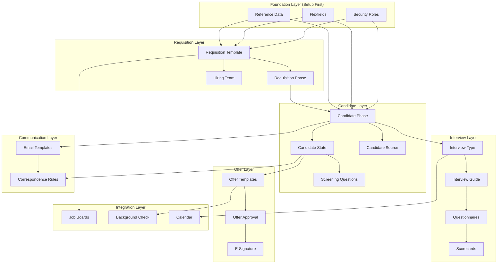

# GEODIS IRC Configuration Tables - Gap Analysis

**Document:** 14_IRC_Configuration_Tables_Analysis.md
**Version:** 1.0
**Created:** 2025-12-07
**Module:** Oracle Recruiting Cloud (IRC)
**Purpose:** Identify all required IRC tables for workflow deployment

---

## Table of Contents

1. [Executive Summary](#1-executive-summary)
2. [Current State - Existing Tables](#2-current-state---existing-tables)
3. [Gap Analysis - Missing Tables](#3-gap-analysis---missing-tables)
4. [Complete IRC Table Inventory](#4-complete-irc-table-inventory)
5. [Configuration Dependencies](#5-configuration-dependencies)
6. [Implementation Priority](#6-implementation-priority)
7. [HDL/HSDL Import Mapping](#7-hdlhsdl-import-mapping)

---

## 1. Executive Summary

### Current State
- **Existing Tables:** 14 configuration files
- **Records Configured:** ~191 total values
- **Coverage:** ~45% of required IRC configuration

### Gap Analysis
- **Missing Tables:** 28 additional tables required
- **Critical Gaps:** Email templates, questionnaires, integrations, security
- **Estimated Effort:** Medium-High complexity

### Tables by Category

| Category | Existing | Missing | Total Required |
|----------|----------|---------|----------------|
| Requisition Setup | 3 | 5 | 8 |
| Candidate Setup | 5 | 6 | 11 |
| Interview Setup | 3 | 4 | 7 |
| Offer Setup | 1 | 5 | 6 |
| Integration Setup | 0 | 5 | 5 |
| Communication | 0 | 4 | 4 |
| Security Setup | 0 | 3 | 3 |
| **TOTAL** | **14** | **28** | **42** |

---

## 2. Current State - Existing Tables

### 2.1 Files in `03 - ORACLE/` Folder

| # | File Name | Records | Status | Notes |
|---|-----------|---------|--------|-------|
| 1 | Requisition Template.xlsx | 5 | Complete | GEODIS_STD, EXEC, FR, US, INTERN |
| 2 | Candidate Phase.xlsx | 12 | Complete | NEW to POOL phases |
| 3 | Candidate State.xlsx | 43 | Complete | All states per phase |
| 4 | Candidate Source.xlsx | 17 | Complete | All source channels |
| 5 | Candidate Pool Type.xlsx | 7 | Complete | Silver, Community, Alumni, etc. |
| 6 | Offer Letter Template.xlsx | 18 | Complete | FR, US, UK, DE, NL templates |
| 7 | Interview Guide.xlsx | 10 | Complete | By job family |
| 8 | Interview Type.xlsx | 9 | Complete | Phone, Video, Panel, etc. |
| 9 | Posting Channel.xlsx | 8 | Complete | Internal + external channels |
| 10 | Rejection Reason.xlsx | 15 | Complete | All rejection categories |
| 11 | Withdrawal Reason.xlsx | 8 | Complete | Candidate withdrawal reasons |
| 12 | Requisition Phase.xlsx | 8 | Complete | Draft to Closed |
| 13 | Recruiting Action.xlsx | 25 | Complete | All workflow actions |
| 14 | Recruiting Approval Workflow.xlsx | 6 | Complete | Approval rules |

**Total Existing Records:** 191

---

## 3. Gap Analysis - Missing Tables

### 3.1 Critical Priority (Must Have)

| # | Table Name | Purpose | Workflow Impact | Est. Records |
|---|------------|---------|-----------------|--------------|
| 1 | **Email Template** | Candidate communications | All notifications | 25-30 |
| 2 | **Screening Question** | Pre-screening questions | Candidate screening | 50-100 |
| 3 | **Job Requisition Flexfield** | Custom requisition fields | Requisition creation | 20-30 |
| 4 | **Candidate Flexfield** | Custom candidate fields | Candidate management | 15-20 |
| 5 | **Assessment Type** | Online assessment configs | Assessment workflow | 8-10 |
| 6 | **Background Check Provider** | Sterling integration | Background check flow | 2-3 |
| 7 | **E-Signature Provider** | DocuSign integration | Offer acceptance | 1-2 |

### 3.2 High Priority (Should Have)

| # | Table Name | Purpose | Workflow Impact | Est. Records |
|---|------------|---------|-----------------|--------------|
| 8 | **Questionnaire** | Interview questionnaires | Interview scoring | 10-15 |
| 9 | **Scorecard Template** | Interview feedback forms | Feedback collection | 8-12 |
| 10 | **Hiring Team Role** | Team member definitions | Hiring team setup | 8-10 |
| 11 | **Requisition Reason** | Reason for opening | Requisition creation | 10-12 |
| 12 | **Job Posting Description** | Standardized JD sections | Job posting | 20-25 |
| 13 | **Salary Grade Mapping** | Grade to salary range | Offer creation | 15-20 |
| 14 | **Document Type** | Required document types | HR processing | 15-20 |
| 15 | **Onboarding Checklist** | Pre-hire tasks | Pre-hire workflow | 20-30 |

### 3.3 Medium Priority (Nice to Have)

| # | Table Name | Purpose | Workflow Impact | Est. Records |
|---|------------|---------|-----------------|--------------|
| 16 | **Correspondence Rule** | Auto-email triggers | Automated comms | 15-20 |
| 17 | **Notification Preference** | User notification settings | Communication | 10-12 |
| 18 | **Calendar Integration** | Interview scheduling | Scheduling flow | 3-5 |
| 19 | **Referral Bonus Rule** | Employee referral bonuses | Referral tracking | 5-8 |
| 20 | **Agency Fee Structure** | Agency commission rules | Agency management | 5-10 |
| 21 | **Campus Event Type** | Campus recruiting events | Campus recruiting | 6-8 |
| 22 | **Job Family Mapping** | Job family to templates | Template selection | 15-20 |

### 3.4 Integration Tables (Required for Full Deployment)

| # | Table Name | Purpose | Integration Point | Est. Records |
|---|------------|---------|-------------------|--------------|
| 23 | **Job Board Connection** | Job board API configs | Indeed, LinkedIn | 4-6 |
| 24 | **External System Mapping** | Field mapping configs | All integrations | 50-100 |
| 25 | **Webhook Configuration** | Event notification URLs | Real-time sync | 10-15 |
| 26 | **Data Migration Mapping** | Source to target mapping | UKG/TS migration | 200+ |
| 27 | **Error Code Reference** | Integration error handling | All integrations | 30-50 |

### 3.5 Security & Compliance Tables

| # | Table Name | Purpose | Compliance Need | Est. Records |
|---|------------|---------|-----------------|--------------|
| 28 | **Security Role** | Role definitions | Access control | 8-12 |
| 29 | **Data Access Rule** | Business unit restrictions | Data security | 10-15 |
| 30 | **Consent Template** | GDPR/privacy consent | Legal compliance | 5-8 |
| 31 | **Retention Policy** | Data retention rules | GDPR compliance | 8-10 |
| 32 | **Audit Configuration** | Audit trail settings | Compliance | 15-20 |

---

## 4. Complete IRC Table Inventory

### 4.1 Requisition Configuration (8 Tables)

```
REQUISITION SETUP
├── Requisition Template.xlsx              [EXISTS] - 5 records
├── Requisition Phase.xlsx                 [EXISTS] - 8 records
├── Requisition Reason.xlsx                [MISSING] - Create
├── Requisition Flexfield.xlsx             [MISSING] - Create
├── Requisition Approval Rule.xlsx         [EXISTS] - 6 records (in Workflow)
├── Requisition Default Value.xlsx         [MISSING] - Create
├── Hiring Team Role.xlsx                  [MISSING] - Create
└── Requisition Collaborator Type.xlsx     [MISSING] - Create
```

### 4.2 Candidate Configuration (11 Tables)

```
CANDIDATE SETUP
├── Candidate Phase.xlsx                   [EXISTS] - 12 records
├── Candidate State.xlsx                   [EXISTS] - 43 records
├── Candidate Source.xlsx                  [EXISTS] - 17 records
├── Candidate Pool Type.xlsx               [EXISTS] - 7 records
├── Candidate Flexfield.xlsx               [MISSING] - Create
├── Screening Question.xlsx                [MISSING] - Create
├── Knockout Question.xlsx                 [MISSING] - Create
├── Duplicate Check Rule.xlsx              [MISSING] - Create
├── Candidate Merge Rule.xlsx              [MISSING] - Create
├── Talent Community.xlsx                  [MISSING] - Create
└── Candidate Profile Section.xlsx         [MISSING] - Create
```

### 4.3 Interview Configuration (7 Tables)

```
INTERVIEW SETUP
├── Interview Type.xlsx                    [EXISTS] - 9 records
├── Interview Guide.xlsx                   [EXISTS] - 10 records
├── Questionnaire.xlsx                     [MISSING] - Create
├── Scorecard Template.xlsx                [MISSING] - Create
├── Interview Slot Configuration.xlsx      [MISSING] - Create
├── Interview Feedback Question.xlsx       [MISSING] - Create
└── Interview Reminder Rule.xlsx           [MISSING] - Create
```

### 4.4 Assessment Configuration (4 Tables)

```
ASSESSMENT SETUP
├── Assessment Type.xlsx                   [MISSING] - Create
├── Assessment Provider.xlsx               [MISSING] - Create
├── Assessment Scoring Rule.xlsx           [MISSING] - Create
└── Assessment Threshold.xlsx              [MISSING] - Create
```

### 4.5 Offer Configuration (6 Tables)

```
OFFER SETUP
├── Offer Letter Template.xlsx             [EXISTS] - 18 records
├── Offer Approval Rule.xlsx               [EXISTS] - In Workflow file
├── Offer Compensation Component.xlsx      [MISSING] - Create
├── Offer Expiry Rule.xlsx                 [MISSING] - Create
├── Counter Offer Rule.xlsx                [MISSING] - Create
└── Offer Condition.xlsx                   [MISSING] - Create
```

### 4.6 Job Posting Configuration (5 Tables)

```
POSTING SETUP
├── Posting Channel.xlsx                   [EXISTS] - 8 records
├── Job Description Section.xlsx           [MISSING] - Create
├── Job Posting Template.xlsx              [MISSING] - Create
├── Posting Duration Rule.xlsx             [MISSING] - Create
└── Internal Posting Rule.xlsx             [MISSING] - Create
```

### 4.7 Communication Configuration (4 Tables)

```
COMMUNICATION SETUP
├── Email Template.xlsx                    [MISSING] - Create (CRITICAL)
├── SMS Template.xlsx                      [MISSING] - Create
├── Correspondence Rule.xlsx               [MISSING] - Create
└── Notification Preference.xlsx           [MISSING] - Create
```

### 4.8 Background Check Configuration (3 Tables)

```
BACKGROUND CHECK SETUP
├── Background Check Provider.xlsx         [MISSING] - Create
├── Background Check Type.xlsx             [MISSING] - Create
└── Background Check Package.xlsx          [MISSING] - Create
```

### 4.9 Integration Configuration (5 Tables)

```
INTEGRATION SETUP
├── Job Board Connection.xlsx              [MISSING] - Create
├── External System Mapping.xlsx           [MISSING] - Create
├── E-Signature Provider.xlsx              [MISSING] - Create
├── Calendar Integration.xlsx              [MISSING] - Create
└── Webhook Configuration.xlsx             [MISSING] - Create
```

### 4.10 Security & Compliance (5 Tables)

```
SECURITY SETUP
├── Security Role.xlsx                     [MISSING] - Create
├── Data Access Rule.xlsx                  [MISSING] - Create
├── Consent Template.xlsx                  [MISSING] - Create
├── Retention Policy.xlsx                  [MISSING] - Create
└── Audit Configuration.xlsx               [MISSING] - Create
```

### 4.11 Reference Data (5 Tables)

```
REFERENCE DATA
├── Rejection Reason.xlsx                  [EXISTS] - 15 records
├── Withdrawal Reason.xlsx                 [EXISTS] - 8 records
├── Recruiting Action.xlsx                 [EXISTS] - 25 records
├── Document Type.xlsx                     [MISSING] - Create
└── Status Reason Code.xlsx                [MISSING] - Create
```

---

## 5. Configuration Dependencies

### 5.1 Dependency Map



### 5.2 Setup Sequence

| Phase | Tables to Configure | Depends On | Duration |
|-------|---------------------|------------|----------|
| 1 | Security Roles, Flexfields | Core HR Setup | Week 1 |
| 2 | Reference Data (Reasons, Actions) | Phase 1 | Week 1 |
| 3 | Requisition Templates, Phases | Phase 1-2 | Week 2 |
| 4 | Candidate Phases, States, Sources | Phase 3 | Week 2-3 |
| 5 | Interview Types, Guides, Questionnaires | Phase 4 | Week 3 |
| 6 | Offer Templates, Approval Rules | Phase 4-5 | Week 3-4 |
| 7 | Email Templates, Correspondence | Phase 4-6 | Week 4 |
| 8 | Job Board Integrations | Phase 3 | Week 4-5 |
| 9 | Background Check, E-Signature | Phase 6 | Week 5 |
| 10 | Testing & Validation | All | Week 6 |

---

## 6. Implementation Priority

### 6.1 Priority Matrix

| Priority | Category | Tables | Status | Action |
|----------|----------|--------|--------|--------|
| P0 | Foundation | Security, Flexfields | MISSING | Create immediately |
| P1 | Core Flow | Email Templates | MISSING | Create ASAP |
| P1 | Core Flow | Screening Questions | MISSING | Create ASAP |
| P2 | Interview | Questionnaires, Scorecards | MISSING | Create Week 2-3 |
| P2 | Offer | Offer Components | MISSING | Create Week 3 |
| P3 | Integration | Job Boards, Sterling | MISSING | Create Week 4-5 |
| P3 | Integration | DocuSign | MISSING | Create Week 5 |
| P4 | Enhancement | Consent, Retention | MISSING | Create Week 5-6 |
| - | Complete | 14 existing tables | EXISTS | Validate |

### 6.2 Effort Estimation

| Category | Tables | Records Est. | Complexity | Hours Est. |
|----------|--------|--------------|------------|------------|
| Foundation | 5 | 80-100 | High | 40-60 |
| Communication | 4 | 50-80 | Medium | 30-40 |
| Screening | 3 | 80-150 | Medium | 25-35 |
| Interview | 4 | 40-60 | Medium | 20-30 |
| Offer | 4 | 30-50 | Medium | 20-25 |
| Integration | 5 | 80-150 | High | 50-70 |
| Security | 5 | 50-80 | High | 35-45 |
| **TOTAL** | **28** | **410-670** | - | **220-305** |

---

## 7. HDL/HSDL Import Mapping

### 7.1 HDL Business Objects

| IRC Object | HDL File | Status |
|------------|----------|--------|
| IRC_RECRUITING_TEMPLATES | RecruitingTemplate.dat | To Create |
| IRC_CANDIDATE_PHASES | CandidatePhase.dat | To Create |
| IRC_CANDIDATE_STATES | CandidateState.dat | To Create |
| IRC_SOURCES | RecruitingSource.dat | To Create |
| IRC_OFFER_TEMPLATES | OfferTemplate.dat | To Create |
| IRC_INTERVIEW_TYPES | InterviewType.dat | To Create |
| IRC_POSTING_CHANNELS | PostingChannel.dat | To Create |
| IRC_REASONS | RecruitingReason.dat | To Create |

### 7.2 HDL Import Format Example

```
METADATA|RecruitingTemplate|TemplateCode|TemplateName|Description|DefaultFlag|StatusCode
MERGE|RecruitingTemplate|GEODIS_STD|GEODIS Standard Requisition|Standard template|Y|A
MERGE|RecruitingTemplate|GEODIS_EXEC|GEODIS Executive Requisition|Executive template|N|A
MERGE|RecruitingTemplate|GEODIS_FR|GEODIS France Requisition|France template|N|A
MERGE|RecruitingTemplate|GEODIS_US|GEODIS US Requisition|US template|N|A
MERGE|RecruitingTemplate|GEODIS_INTERN|GEODIS Intern/Trainee|Intern template|N|A
```

### 7.3 HSDL Setup Data Format

```
-- Candidate Phase Setup
BEGIN
  HCM_RECRUITING_SETUP.CREATE_CANDIDATE_PHASE(
    p_phase_code => 'NEW',
    p_phase_name => 'New',
    p_sequence => 1,
    p_status => 'A'
  );
END;
```

---

## 8. Appendix: Missing Tables Detail

### A. Email Template (CRITICAL - 25+ Templates Needed)

| Template Code | Template Name | Trigger Event |
|---------------|---------------|---------------|
| EMAIL_APPLY_CONFIRM | Application Confirmation | Candidate applies |
| EMAIL_SCREEN_INVITE | Screening Invitation | Move to Screen phase |
| EMAIL_INTERVIEW_INVITE | Interview Invitation | Interview scheduled |
| EMAIL_INTERVIEW_REMIND | Interview Reminder | 24h before interview |
| EMAIL_INTERVIEW_RESCHEDULE | Interview Rescheduled | Interview time changed |
| EMAIL_INTERVIEW_CANCEL | Interview Cancelled | Interview cancelled |
| EMAIL_ASSESSMENT_INVITE | Assessment Invitation | Assessment assigned |
| EMAIL_OFFER_EXTEND | Offer Letter | Offer extended |
| EMAIL_OFFER_REMIND | Offer Reminder | 3 days before expiry |
| EMAIL_OFFER_ACCEPT | Offer Accepted Confirm | Candidate accepts |
| EMAIL_OFFER_DECLINE | Offer Declined Confirm | Candidate declines |
| EMAIL_REJECT_SCREEN | Rejection - Screening | Rejected at screening |
| EMAIL_REJECT_INTERVIEW | Rejection - Interview | Rejected at interview |
| EMAIL_REJECT_GENERAL | Rejection - General | General rejection |
| EMAIL_POOL_ADD | Talent Pool Addition | Added to pool |
| EMAIL_REQ_APPROVAL | Requisition for Approval | Approval requested |
| EMAIL_REQ_APPROVED | Requisition Approved | Requisition approved |
| EMAIL_REQ_REJECTED | Requisition Rejected | Requisition rejected |
| EMAIL_BG_INITIATE | Background Check Start | BG check initiated |
| EMAIL_BG_COMPLETE | Background Check Complete | BG check done |
| EMAIL_ONBOARD_WELCOME | Onboarding Welcome | Hire confirmed |
| EMAIL_FEEDBACK_REQUEST | Interview Feedback Request | Interview completed |
| EMAIL_FEEDBACK_OVERDUE | Feedback Overdue | 48h after interview |
| EMAIL_REFERRAL_CONFIRM | Referral Confirmation | Referral submitted |
| EMAIL_REFERRAL_HIRED | Referral Hired | Referred candidate hired |

### B. Screening Question Categories

| Category | Question Type | Est. Questions |
|----------|---------------|----------------|
| Eligibility | Right to work, Visa status | 5-8 |
| Experience | Years experience, Industry | 8-12 |
| Education | Degree, Certifications | 5-8 |
| Skills | Technical skills, Languages | 10-15 |
| Logistics | Location, Travel, Shift | 8-10 |
| Compliance | Background consent, NDA | 5-8 |
| Role-Specific | Job family specific | 20-40 |

### C. Scorecard Template Structure

```
SCORECARD: Technical Interview
├── Section: Technical Skills (40%)
│   ├── Question: Domain knowledge (1-5)
│   ├── Question: Problem solving (1-5)
│   └── Question: Technical communication (1-5)
├── Section: Experience (30%)
│   ├── Question: Relevant experience (1-5)
│   └── Question: Industry knowledge (1-5)
├── Section: Cultural Fit (20%)
│   ├── Question: GEODIS values alignment (1-5)
│   └── Question: Team collaboration (1-5)
└── Section: Overall (10%)
    ├── Question: Overall impression (1-5)
    └── Recommendation: Hire / No Hire / Maybe
```

---

## 9. Action Items

### Immediate Actions (Week 1)

- [ ] Create Email Template.xlsx with 25 templates
- [ ] Create Screening Question.xlsx with knockout questions
- [ ] Create Requisition Flexfield.xlsx
- [ ] Create Candidate Flexfield.xlsx
- [ ] Validate existing 14 files for completeness

### Short-Term Actions (Week 2-3)

- [ ] Create Questionnaire.xlsx for interviews
- [ ] Create Scorecard Template.xlsx
- [ ] Create Hiring Team Role.xlsx
- [ ] Create Document Type.xlsx
- [ ] Create Assessment Type.xlsx

### Medium-Term Actions (Week 4-5)

- [ ] Create Job Board Connection.xlsx (Indeed, LinkedIn)
- [ ] Create Background Check Provider.xlsx (Sterling)
- [ ] Create E-Signature Provider.xlsx (DocuSign)
- [ ] Create Correspondence Rule.xlsx
- [ ] Create Security Role.xlsx

### Pre-Go-Live Actions (Week 6)

- [ ] Create Consent Template.xlsx (GDPR)
- [ ] Create Retention Policy.xlsx
- [ ] Validate all HDL imports
- [ ] End-to-end workflow testing
- [ ] User acceptance testing

---

## Document Information

| Attribute | Value |
|-----------|-------|
| Document ID | 14_IRC_Configuration_Tables_Analysis |
| Version | 1.0 |
| Created | 2025-12-07 |
| Existing Tables | 14 |
| Missing Tables | 28 |
| Total Required | 42 |

---

*End of Document*
