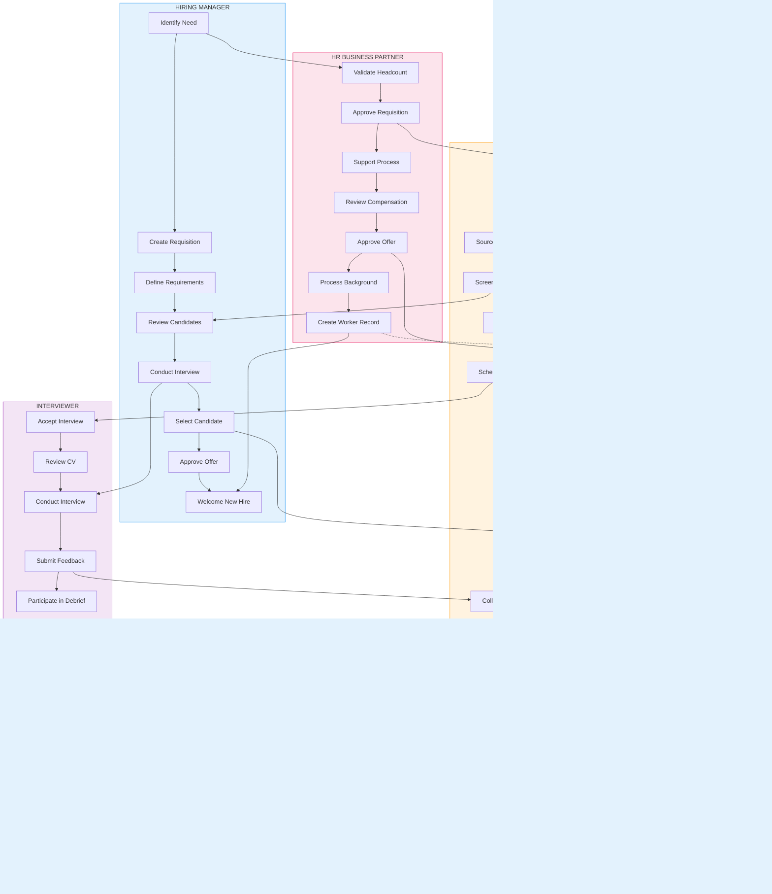

# GEODIS Recruitment Process - Swimlane Diagrams

**Document:** 19_GEODIS_Recruitment_Swimlane_Diagrams.md
**Version:** 1.0
**Created:** 2025-12-07
**Module:** Oracle Recruiting Cloud (IRC)
**Project:** GEODIS HCM Transformation

---

## Table of Contents

1. [End-to-End Master Swimlane](#1-end-to-end-master-swimlane)
2. [Requisition Creation & Approval](#2-requisition-creation--approval)
3. [Job Posting & Sourcing](#3-job-posting--sourcing)
4. [Candidate Screening & Shortlisting](#4-candidate-screening--shortlisting)
5. [Interview & Assessment](#5-interview--assessment)
6. [Selection & Decision](#6-selection--decision)
7. [Offer Management](#7-offer-management)
8. [Background Check & Pre-Hire](#8-background-check--pre-hire)
9. [Hire & Onboarding Handoff](#9-hire--onboarding-handoff)

---

## 1. End-to-End Master Swimlane

### Complete Recruitment Lifecycle by Role

### Legend
| Lane Color | Role | Primary Responsibility |
|------------|------|----------------------|
| Green | Candidate | Apply, interview, accept offer |
| Blue | Hiring Manager | Define need, interview, select |
| Orange | Recruiter | Source, screen, coordinate |
| Pink | HR Business Partner | Approve, compliance, process |
| Purple | Interviewer | Assess, provide feedback |

---

## 2. Requisition Creation & Approval

### Detailed Requisition Workflow by Role

### Approval Matrix Reference

| Salary Band | Approval Chain | SLA |
|-------------|---------------|-----|
| < EUR 125K | Manager → HRBP | 2 days |
| EUR 125K - 155K | Manager → Director → HRBP | 3 days |
| > EUR 155K / TOPEX | Manager → Director → VP → CHRO | 5 days |

---

## 3. Job Posting & Sourcing

### Multi-Channel Posting Workflow

### Posting Channel Matrix

| Channel | Type | Auto-Post | Application Sync |
|---------|------|-----------|-----------------|
| Internal Portal | Internal | Yes | Real-time |
| GEODIS Career Site | External | Yes | Real-time |
| Indeed | External | API | 15 min |
| LinkedIn | External | API | 15 min |
| Glassdoor | External | Manual | Daily |
| Agencies | External | Manual | Manual |

---

## 4. Candidate Screening & Shortlisting

### Screening Workflow by Role

### Screening Criteria Checklist

| Criterion | Auto-Check | Manual Review |
|-----------|------------|---------------|
| Right to Work | Yes | If unclear |
| Minimum Education | Yes | No |
| Minimum Experience | Yes | No |
| Required Skills | Partial | Yes |
| Location Match | Yes | If remote |
| Salary Expectations | No | Yes |
| Cultural Fit | No | Yes |

---

## 5. Interview & Assessment

### Interview Process Swimlane

### Interview Type Matrix

| Interview Type | Format | Duration | Participants |
|---------------|--------|----------|--------------|
| Phone Screen | Phone/Video | 30 min | Recruiter |
| Technical | Video/Onsite | 60 min | Technical Lead |
| Behavioral | Video/Onsite | 45 min | Hiring Manager |
| Panel | Video/Onsite | 90 min | 3-4 Interviewers |
| Case Study | Video/Onsite | 60 min | Senior Manager |
| Executive | Onsite | 2 hours | VP/Director |

---

## 6. Selection & Decision

### Decision-Making Swimlane

### Decision Criteria Framework

| Factor | Weight | Evaluators |
|--------|--------|------------|
| Technical Skills | 30% | Technical Interviewers |
| Experience | 25% | Hiring Manager |
| Cultural Fit | 20% | All Interviewers |
| Communication | 15% | All Interviewers |
| Growth Potential | 10% | Hiring Manager + HR |

---

## 7. Offer Management

### Offer Creation & Approval Swimlane

### Offer Templates by Region

| Region | Contract Type | Template Code |
|--------|--------------|---------------|
| USA | At-Will | US_STD, US_EXEC |
| France | CDI/CDD | FR_CDI, FR_CDD, FR_CADRE |
| Germany | Standard/Fixed | DE_STD, DE_EXEC |
| UK | Standard | UK_STD, UK_EXEC |
| Netherlands | Standard | NL_STD, NL_EXEC |

---

## 8. Background Check & Pre-Hire

### Background & Document Collection Swimlane

### Background Check Components

| Check Type | Standard | Executive | Intern |
|------------|----------|-----------|--------|
| Criminal History | Yes | Yes | Yes |
| Employment Verification | 7 years | 10 years | N/A |
| Education Verification | Highest | All | Yes |
| Reference Checks | 2 | 3 | 1 |
| Credit Check | If Financial | Yes | No |
| Drug Screening | US Only | US Only | US Only |

---

## 9. Hire & Onboarding Handoff

### Worker Creation & System Sync Swimlane

### Onboarding Checklist by Role

| Task | Owner | Timing |
|------|-------|--------|
| Create Worker Record | HR | D-5 |
| IT Account Setup | IT | D-3 |
| Workspace Prep | Manager | D-2 |
| Welcome Email | HR | D-1 |
| Day 1 Orientation | Onboarding Team | D |
| Benefits Enrollment | Employee | D+1 to D+30 |
| Compliance Training | Employee | D+1 to D+7 |
| 30-Day Check-in | Manager | D+30 |
| 90-Day Review | Manager + HR | D+90 |

---

## Summary: Key Actors & Responsibilities

### Actor Responsibility Matrix

| Actor | Key Responsibilities | Tools Used |
|-------|---------------------|------------|
| **Hiring Manager** | Define need, interview, select, welcome | Oracle Recruiting, Outlook |
| **Recruiter** | Post, source, screen, schedule, coordinate | Oracle Recruiting, LinkedIn, Indeed |
| **HR Business Partner** | Approve, compliance, process hire | Oracle Recruiting, Core HR |
| **Interviewer** | Assess, provide structured feedback | Oracle Recruiting (Scorecard) |
| **Compensation Team** | Validate salary, approve exceptions | Oracle Compensation |
| **Legal** | Review background issues, compliance | Case Management |
| **IT** | Provision accounts, equipment | ServiceNow |
| **Candidate/Employee** | Apply, interview, accept, onboard | Career Site, Employee Portal |

---

## Document Information

| Attribute | Value |
|-----------|-------|
| Document ID | 19_GEODIS_Recruitment_Swimlane_Diagrams |
| Version | 1.0 |
| Created | 2025-12-07 |
| Total Diagrams | 9 |
| Format | Mermaid Markdown (Swimlane style) |
| Related Docs | 12_Workflows, 13_Mermaid_Diagrams |

---

*End of Document*
