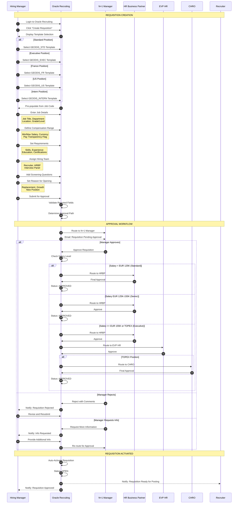
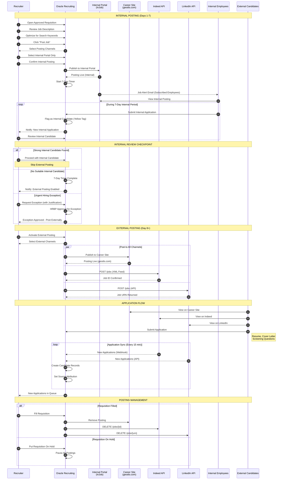
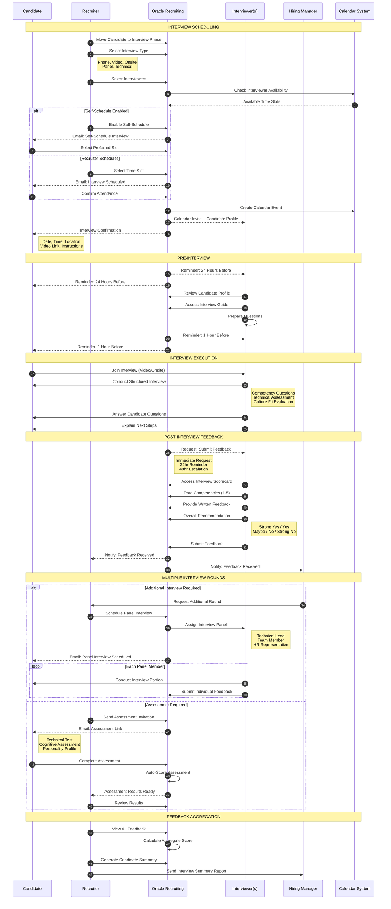
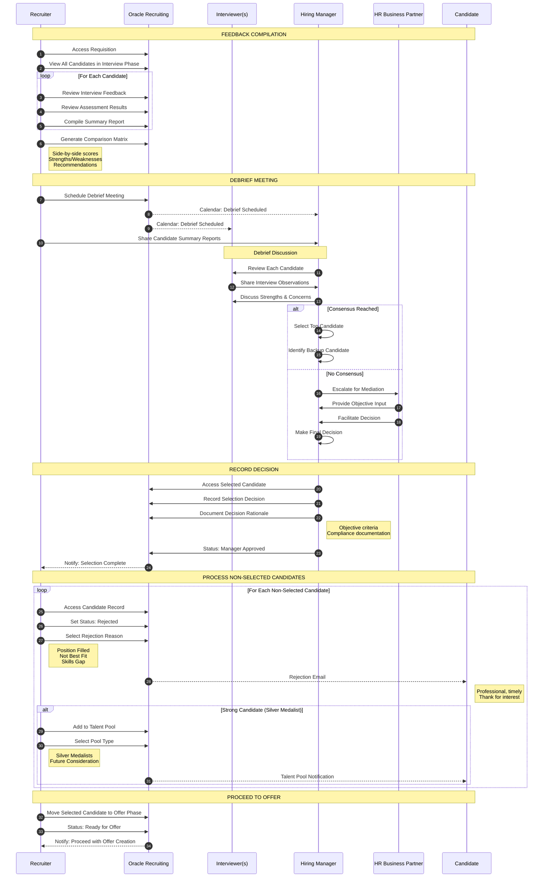
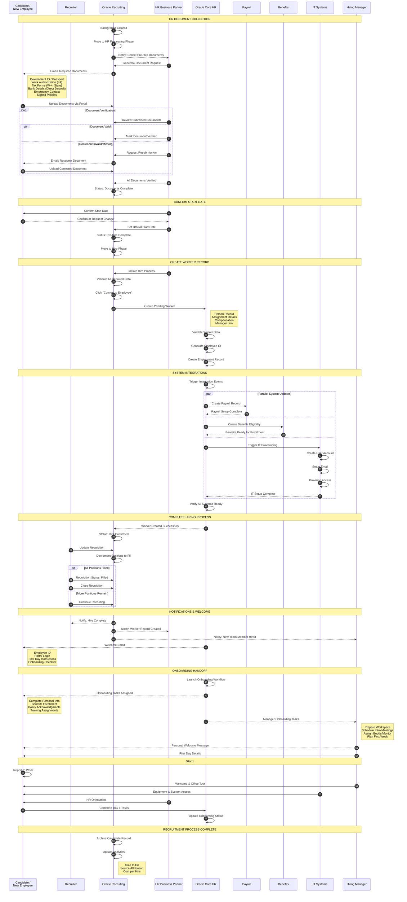
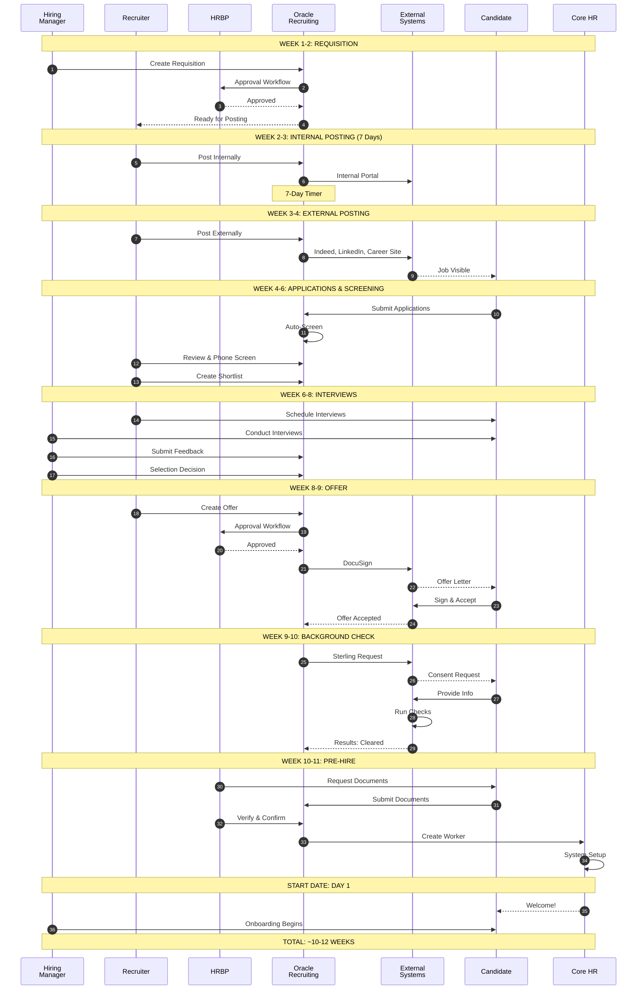

# GEODIS Recruitment Process - End-to-End Sequence Diagram

**Document:** 20_GEODIS_Recruitment_End_to_End_Sequence_Diagram.md
**Version:** 1.0
**Created:** 2025-12-08
**Module:** Oracle Recruiting Cloud (IRC)
**Project:** GEODIS HCM Transformation

---

## Table of Contents

1. [Master End-to-End Sequence Diagram](#1-master-end-to-end-sequence-diagram)
2. [Phase 1: Requisition Creation & Approval](#2-phase-1-requisition-creation--approval)
3. [Phase 2: Job Posting & Sourcing](#3-phase-2-job-posting--sourcing)
4. [Phase 3: Application & Screening](#4-phase-3-application--screening)
5. [Phase 4: Interview & Assessment](#5-phase-4-interview--assessment)
6. [Phase 5: Selection & Decision](#6-phase-5-selection--decision)
7. [Phase 6: Offer Management](#7-phase-6-offer-management)
8. [Phase 7: Background Check & Compliance](#8-phase-7-background-check--compliance)
9. [Phase 8: Hire & Onboarding Handoff](#9-phase-8-hire--onboarding-handoff)
10. [Complete Integrated Sequence](#10-complete-integrated-sequence)

---

## 1. Master End-to-End Sequence Diagram

### 1.1 Complete Recruitment Lifecycle Overview

```mermaid
sequenceDiagram
    autonumber

    participant HM as Hiring Manager
    participant REC as Recruiter
    participant HR as HR Business Partner
    participant ORC as Oracle Recruiting
    participant JB as Job Boards<br/>(Indeed/LinkedIn)
    participant CAND as Candidate
    participant INT as Interviewer(s)
    participant COMP as Compensation
    participant DOCU as DocuSign
    participant STER as Sterling<br/>(Background)
    participant CORE as Oracle Core HR

    rect rgb(227, 242, 253)
    Note over HM,CORE: PHASE 1: REQUISITION CREATION & APPROVAL
    HM->>ORC: Create Requisition (Select Template)
    HM->>ORC: Define Job Details, Requirements, Compensation Range
    HM->>ORC: Assign Hiring Team (Recruiter, HRBP)
    HM->>ORC: Submit for Approval
    ORC->>HR: Route to N+1 Manager for Approval
    HR-->>ORC: Approve/Reject
    alt Salary >= EUR 125K
        ORC->>HR: Route to HRBP
        HR-->>ORC: Approve
        alt Salary >= EUR 155K or TOPEX
            ORC->>HR: Route to EVP HR / CHRO
            HR-->>ORC: Final Approval
        end
    end
    ORC->>REC: Notify: Requisition Approved & Activated
    end

    rect rgb(243, 229, 245)
    Note over HM,CORE: PHASE 2: JOB POSTING & SOURCING (7-Day Internal Rule)
    REC->>ORC: Post Job Internally (Employee Portal)
    ORC->>ORC: Start 7-Day Internal Timer
    ORC-->>CAND: Internal Job Alert Emails

    Note over ORC: After 7 Days (or with Exception)
    REC->>ORC: Activate External Posting
    ORC->>JB: Publish to Career Site, Indeed, LinkedIn
    JB-->>CAND: Job Visible on External Sites
    end

    rect rgb(232, 245, 233)
    Note over HM,CORE: PHASE 3: APPLICATION & SCREENING
    CAND->>JB: View Job Posting
    CAND->>ORC: Submit Application (Resume, Questions)
    ORC->>ORC: Auto-Screen (Minimum Qualifications)
    alt Fails Auto-Screen
        ORC-->>CAND: Rejection Email (Auto)
    else Passes Auto-Screen
        ORC->>REC: New Application in Queue
        REC->>ORC: Review Application
        REC->>ORC: Calculate Score & Rank
        alt Qualified
            REC->>ORC: Move to Screening Phase
            REC->>CAND: Schedule Phone Screen
            CAND-->>REC: Confirm Time Slot
            REC->>CAND: Conduct Phone Screen
            REC->>ORC: Log Screening Notes & Decision
        else Not Qualified
            REC->>ORC: Reject with Reason
            ORC-->>CAND: Rejection Email
        end
    end
    end

    rect rgb(255, 243, 224)
    Note over HM,CORE: PHASE 4: INTERVIEW & ASSESSMENT
    REC->>ORC: Move Candidate to Interview Phase
    REC->>INT: Request Interview Availability
    INT-->>REC: Provide Available Slots
    REC->>CAND: Send Interview Invitation
    CAND-->>REC: Confirm Interview
    ORC->>INT: Calendar Invite + Candidate Profile
    ORC->>CAND: Interview Confirmation + Details

    Note over INT,CAND: Interview Day
    INT->>CAND: Conduct Interview
    INT->>ORC: Submit Interview Feedback (Scorecard)
    ORC->>HM: Notify: Feedback Received

    alt Multiple Interview Rounds
        REC->>CAND: Schedule Additional Interviews
        INT->>CAND: Conduct Panel/Technical Interview
        INT->>ORC: Submit All Feedback
    end
    end

    rect rgb(252, 228, 236)
    Note over HM,CORE: PHASE 5: SELECTION & DECISION
    REC->>ORC: Compile All Interview Feedback
    REC->>HM: Schedule Debrief Meeting
    HM->>INT: Debrief Discussion
    HM->>ORC: Record Final Decision
    alt Candidate Selected
        HM->>ORC: Approve Candidate for Offer
        ORC->>REC: Notify: Ready for Offer
    else Candidate Not Selected
        HM->>ORC: Reject Candidate
        ORC-->>CAND: Rejection Email
        REC->>ORC: Add to Talent Pool (Silver Medalist)?
    end
    end

    rect rgb(255, 248, 225)
    Note over HM,CORE: PHASE 6: OFFER MANAGEMENT
    REC->>ORC: Create Offer (Select Template by Country)
    REC->>COMP: Request Compensation Validation
    COMP-->>REC: Validate Salary within Range
    alt Salary Exception Required
        COMP->>HR: Exception Approval Request
        HR-->>COMP: Approve/Deny Exception
    end
    REC->>ORC: Submit Offer for Approval
    ORC->>HM: Route for Manager Approval
    HM-->>ORC: Approve Offer
    alt High Value Offer (>= EUR 125K)
        ORC->>HR: Route to HRBP/EVP HR
        HR-->>ORC: Final Approval
    end

    ORC->>DOCU: Generate Offer Letter (E-Signature)
    DOCU-->>CAND: Email: Offer Letter for Signature
    CAND->>DOCU: Review & Sign Offer
    DOCU-->>ORC: Signed Offer Returned
    ORC->>REC: Notify: Offer Accepted
    ORC->>HM: Notify: Offer Accepted
    end

    rect rgb(224, 242, 241)
    Note over HM,CORE: PHASE 7: BACKGROUND CHECK & COMPLIANCE
    ORC->>STER: Initiate Background Check Request
    STER-->>CAND: Email: Consent & Information Request
    CAND->>STER: Provide Consent & Details
    STER->>STER: Run Background Checks
    Note over STER: Criminal, Employment, Education, References
    STER-->>ORC: Background Check Results
    alt All Clear
        ORC->>HR: Notify: Background Cleared
    else Issues Found
        ORC->>HR: Flag for Review
        HR->>HR: Assess Risk
        alt Proceed with Conditions
            HR->>ORC: Clear with Notes
        else Rescind Offer
            HR->>ORC: Rescind Offer
            ORC-->>CAND: Offer Rescinded Notification
        end
    end
    end

    rect rgb(225, 245, 254)
    Note over HM,CORE: PHASE 8: HIRE & ONBOARDING HANDOFF
    HR->>CAND: Request Pre-Hire Documents
    CAND-->>HR: Submit Documents (ID, Tax Forms, etc.)
    HR->>ORC: Verify Documents Complete
    HR->>ORC: Confirm Start Date

    ORC->>CORE: Create Worker Record (Pending Worker)
    CORE->>CORE: Generate Employee ID
    CORE->>CORE: Trigger System Integrations
    Note over CORE: Payroll, Benefits, IT Provisioning

    ORC->>REC: Update Requisition Status: Filled
    REC->>ORC: Close Requisition

    CORE-->>CAND: Welcome Email + Portal Access
    CORE-->>HM: Notify: New Hire Ready
    HM->>CAND: Welcome & Onboarding Schedule

    Note over HM,CORE: RECRUITMENT PROCESS COMPLETE
    end
```

---

## 2. Phase 1: Requisition Creation & Approval

### Detailed Requisition Workflow

---

## 3. Phase 2: Job Posting & Sourcing

### Job Posting Workflow with 7-Day Internal Rule

---

## 4. Phase 3: Application & Screening

### Candidate Screening Workflow

```mermaid
sequenceDiagram
    autonumber

    participant CAND as Candidate
    participant ORC as Oracle Recruiting
    participant REC as Recruiter
    participant HM as Hiring Manager

    Note over CAND,HM: APPLICATION SUBMISSION

    CAND->>ORC: Access Job Posting
    CAND->>ORC: Click "Apply"
    ORC-->>CAND: Display Application Form

    CAND->>ORC: Upload Resume/CV
    ORC->>ORC: Parse Resume (AI)
    ORC-->>CAND: Pre-fill Profile from Resume

    CAND->>ORC: Complete Profile
    Note right of CAND: Contact Info, Experience<br/>Education, Skills

    CAND->>ORC: Answer Screening Questions
    Note right of CAND: Disqualifying Questions<br/>Scored Questions

    CAND->>ORC: Submit Application
    ORC-->>CAND: Application Confirmation Email

    Note over CAND,HM: AUTO-SCREENING

    ORC->>ORC: Run Auto-Screening Rules

    ORC->>ORC: Check Minimum Qualifications
    alt Fails Minimum Requirements
        ORC->>ORC: Status: Auto-Rejected
        ORC-->>CAND: Rejection Email (Automated)
        Note over ORC: Process Ends
    end

    ORC->>ORC: Check Right to Work
    alt No Right to Work
        ORC->>ORC: Status: Auto-Rejected
        ORC-->>CAND: Rejection Email (Automated)
    end

    ORC->>ORC: Check Location Requirements
    ORC->>ORC: Calculate Screening Score
    ORC->>ORC: Rank Against Other Candidates

    ORC->>ORC: Check for Duplicate Candidate
    alt Duplicate Found
        ORC->>ORC: Merge with Existing Record
        ORC->>ORC: Link to New Requisition
    end

    ORC->>ORC: Status: NEW - Pending Review
    ORC-->>REC: Notify: New Application

    Note over CAND,HM: RECRUITER SCREENING

    REC->>ORC: Access Application Queue
    REC->>ORC: Filter by Score/Date/Source
    REC->>ORC: View Candidate Profile
    REC->>ORC: Review Resume
    REC->>ORC: Review Screening Answers

    alt Candidate Qualified
        REC->>ORC: Move to Screening Phase
        REC->>ORC: Schedule Phone Screen

        ORC-->>CAND: Email: Phone Screen Invitation
        Note right of CAND: Self-Schedule Link<br/>Available Time Slots

        CAND->>ORC: Select Time Slot
        ORC-->>CAND: Phone Screen Confirmation
        ORC-->>REC: Calendar: Phone Screen Scheduled

        Note over REC,CAND: Phone Screen (30 min)
        REC->>CAND: Conduct Phone Screen
        Note right of REC: Skills Assessment<br/>Culture Fit<br/>Salary Expectations<br/>Availability

        REC->>ORC: Log Phone Screen Notes
        REC->>ORC: Update Screening Status

        alt Pass Phone Screen
            REC->>ORC: Status: Screening Passed
            REC->>ORC: Move to Interview Phase
        else Fail Phone Screen
            REC->>ORC: Reject with Reason
            ORC-->>CAND: Rejection Email
            REC->>ORC: Add to Talent Pool?
        end

    else Candidate Not Qualified
        REC->>ORC: Reject with Reason
        Note right of REC: Select Rejection Reason<br/>from Standard List
        ORC-->>CAND: Rejection Email

    else Maybe - Hold for Review
        REC->>ORC: Add to Hold/Review List
        REC->>HM: Request Hiring Manager Opinion
        HM->>ORC: Review Candidate
        HM-->>REC: Proceed / Reject
    end

    Note over CAND,HM: SHORTLIST CREATION

    REC->>ORC: Review All Screened Candidates
    REC->>ORC: Create Shortlist (Top 5-10)
    REC->>HM: Share Shortlist for Review
    HM->>ORC: Review Shortlisted Candidates
    HM-->>REC: Approve Shortlist / Request Changes
```

---

## 5. Phase 4: Interview & Assessment

### Interview Process Workflow

---

## 6. Phase 5: Selection & Decision

### Candidate Selection Workflow

---

## 7. Phase 6: Offer Management

### Offer Creation & Approval Workflow

```mermaid
sequenceDiagram
    autonumber

    participant REC as Recruiter
    participant ORC as Oracle Recruiting
    participant COMP as Compensation Team
    participant HM as Hiring Manager
    participant HR as HR Business Partner
    participant EVP as EVP HR
    participant DOCU as DocuSign
    participant CAND as Candidate

    Note over REC,CAND: OFFER CREATION

    REC->>ORC: Access Selected Candidate
    REC->>ORC: Click "Create Offer"

    ORC-->>REC: Display Offer Form
    ORC->>ORC: Pre-fill from Candidate Profile
    ORC->>ORC: Pre-fill from Requisition

    REC->>ORC: Select Offer Template
    Note right of REC: By Country & Job Family

    alt US Position
        REC->>ORC: Select US_STD or US_EXEC Template
    else France Position
        REC->>ORC: Select FR_CDI, FR_CDD, or FR_CADRE Template
    else UK Position
        REC->>ORC: Select UK_STD Template
    else Germany Position
        REC->>ORC: Select DE_STD Template
    else Netherlands Position
        REC->>ORC: Select NL_STD Template
    end

    REC->>ORC: Enter Compensation Details
    Note right of REC: Base Salary, Currency<br/>Bonus Target %<br/>Sign-on Bonus

    REC->>ORC: Set Start Date
    REC->>ORC: Add Benefits Summary
    REC->>ORC: Add Special Conditions

    Note over REC,CAND: COMPENSATION VALIDATION

    REC->>COMP: Request Salary Validation
    COMP->>ORC: Review Proposed Salary
    COMP->>ORC: Check Against Grade Range

    alt Within Salary Range
        COMP-->>REC: Salary Approved
    else Outside Salary Range
        COMP->>HR: Request Exception Approval
        HR->>ORC: Review Exception Request
        alt Exception Approved
            HR-->>COMP: Exception Granted
            COMP-->>REC: Proceed with Offer
        else Exception Denied
            HR-->>COMP: Exception Denied
            COMP-->>REC: Revise Compensation
            REC->>ORC: Adjust Salary
        end
    end

    Note over REC,CAND: OFFER APPROVAL WORKFLOW

    REC->>ORC: Submit Offer for Approval
    ORC->>ORC: Determine Approval Path

    ORC->>HM: Route to Hiring Manager
    ORC-->>HM: Email: Offer Pending Approval

    HM->>ORC: Review Offer Details
    alt Approve
        HM->>ORC: Approve Offer
    else Request Changes
        HM->>ORC: Return with Comments
        ORC-->>REC: Revise Offer
        REC->>ORC: Resubmit
    end

    ORC->>ORC: Check Salary Threshold

    alt Salary < EUR 125K (Standard)
        ORC->>HR: Route to HRBP
        HR->>ORC: Final Approval

    else Salary >= EUR 125K (High Value)
        ORC->>HR: Route to HRBP
        HR->>ORC: Approve
        ORC->>EVP: Route to EVP HR
        EVP->>ORC: Final Approval

    else TOPEX Position
        ORC->>HR: Route to CHRO
        HR->>ORC: Final Approval
    end

    ORC->>ORC: Status: Offer Approved
    ORC-->>REC: Notify: Ready to Extend

    Note over REC,CAND: OFFER EXTENSION (E-SIGNATURE)

    REC->>ORC: Click "Extend Offer"
    ORC->>ORC: Generate Offer Letter PDF
    ORC->>DOCU: Send to DocuSign

    DOCU->>DOCU: Prepare Envelope
    DOCU->>DOCU: Apply Signature Fields
    DOCU-->>CAND: Email: Offer Letter Ready for Signature

    Note over REC,CAND: CANDIDATE RESPONSE

    CAND->>DOCU: Open Offer Letter
    CAND->>DOCU: Review Terms

    alt Accept Offer
        CAND->>DOCU: Sign Electronically
        DOCU-->>ORC: Webhook: Offer Signed
        ORC->>ORC: Attach Signed Offer
        ORC->>ORC: Status: Offer Accepted
        ORC-->>REC: Notify: Offer Accepted
        ORC-->>HM: Notify: Offer Accepted
        ORC-->>CAND: Confirmation: Welcome to GEODIS

    else Negotiate
        CAND->>REC: Counter-Offer Request
        REC->>HM: Discuss Counter Terms
        alt Accept Counter
            REC->>ORC: Revise Offer
            REC->>ORC: Resubmit for Approval
            Note over REC: Return to Approval Process
        else Decline Counter
            REC-->>CAND: Final Offer - No Changes
            CAND->>DOCU: Accept or Decline
        end

    else Decline Offer
        CAND->>DOCU: Decline
        DOCU-->>ORC: Webhook: Offer Declined
        ORC->>ORC: Status: Offer Declined
        ORC-->>REC: Notify: Offer Declined
        REC->>ORC: Capture Decline Reason

        alt Backup Candidate Available
            REC->>ORC: Proceed with Backup Candidate
        else No Backup
            REC->>ORC: Reopen Requisition
        end

    else No Response (5 Days)
        ORC-->>CAND: Reminder Day 3
        ORC-->>CAND: Final Notice Day 5
        ORC->>ORC: Status: Offer Expired
        ORC-->>REC: Notify: No Response
    end
```

---

## 8. Phase 7: Background Check & Compliance

### Background Check Integration Workflow

```mermaid
sequenceDiagram
    autonumber

    participant REC as Recruiter
    participant ORC as Oracle Recruiting
    participant OIC as Oracle Integration Cloud
    participant STER as Sterling API
    participant CAND as Candidate
    participant HR as HR Business Partner
    participant LEGAL as Legal Team

    Note over REC,LEGAL: INITIATE BACKGROUND CHECK

    ORC->>ORC: Offer Accepted Trigger
    ORC->>ORC: Move to Background Check Phase
    ORC-->>REC: Notify: Initiate Background Check

    REC->>ORC: Click "Request Background Check"
    ORC->>ORC: Select Check Package
    Note right of ORC: GEODIS NON-EXEMPT<br/>GEODIS EXEMPT<br/>GEODIS EXECUTIVE

    ORC->>OIC: Background Check Request
    OIC->>OIC: Transform to Sterling Format
    OIC->>STER: POST /orders (Candidate Info)
    STER-->>OIC: Order ID
    OIC-->>ORC: Store Order Reference

    ORC->>ORC: Status: Background Initiated
    ORC-->>REC: Notify: Background Check Started

    Note over REC,LEGAL: CANDIDATE CONSENT

    STER-->>CAND: Email: Consent Request
    Note right of CAND: Authorization Form<br/>Information Request

    CAND->>STER: Open Consent Portal
    CAND->>STER: Provide Authorization
    CAND->>STER: Enter Required Information
    Note right of CAND: SSN, Address History<br/>Employment Details<br/>Education Details

    STER-->>OIC: Webhook: Consent Received
    OIC-->>ORC: Update Status
    ORC->>ORC: Status: Background In Progress

    Note over REC,LEGAL: BACKGROUND INVESTIGATION

    STER->>STER: Run Background Checks

    par Parallel Checks
        STER->>STER: SSN Trace
    and
        STER->>STER: County Criminal Records
    and
        STER->>STER: National Criminal Search
    and
        STER->>STER: Sex Offender Registry
    and
        STER->>STER: Employment Verification
    and
        STER->>STER: Education Verification
    end

    Note right of STER: Processing: 3-7 Business Days

    loop Status Polling (Daily)
        OIC->>STER: GET /orders/{id}/status
        STER-->>OIC: Status Update
        OIC-->>ORC: Update Progress
    end

    Note over REC,LEGAL: RESULTS DELIVERY

    STER->>STER: All Checks Complete
    STER-->>OIC: Webhook: Order Complete

    OIC->>STER: GET /orders/{id}/report
    STER-->>OIC: Full Report (PDF + JSON)

    OIC->>ORC: Send Results
    ORC->>ORC: Parse Results
    ORC->>ORC: Attach Report Document

    alt All Clear
        ORC->>ORC: Status: Background Cleared
        ORC-->>REC: Notify: Background Cleared
        ORC-->>HR: Notify: Proceed with Hire

    else Issues Found
        ORC->>ORC: Status: Background Issue
        ORC-->>HR: Alert: Review Required

        HR->>ORC: Review Findings
        HR->>ORC: Access Full Report

        alt Minor Issue - Proceed
            HR->>ORC: Clear with Notes
            ORC->>ORC: Status: Background Cleared
            ORC->>ORC: Document Decision

        else Concern - Legal Review
            HR->>LEGAL: Escalate to Legal
            LEGAL->>ORC: Review Case
            LEGAL->>HR: Legal Opinion

            alt Proceed with Conditions
                HR->>ORC: Clear with Conditions
                HR->>ORC: Document Conditions
                ORC->>ORC: Status: Background Cleared

            else Do Not Proceed
                HR->>ORC: Fail Background
                ORC->>ORC: Status: Background Failed
                ORC-->>REC: Notify: Rescind Offer
                REC->>ORC: Initiate Offer Rescission
                ORC-->>CAND: Formal Rescission Notice
            end

        else Serious Issue - Fail
            HR->>ORC: Fail Background
            ORC->>ORC: Status: Background Failed
            ORC-->>REC: Notify: Rescind Offer

            REC->>ORC: Rescind Offer
            ORC-->>CAND: Adverse Action Notice
            Note right of CAND: Pre-Adverse Letter<br/>Wait Period<br/>Final Adverse Letter
        end
    end

    Note over REC,LEGAL: PROCEED TO HR PROCESSING

    ORC->>ORC: Background Phase Complete
    ORC->>ORC: Move to HR Processing Phase
    ORC-->>HR: Notify: Ready for Document Collection
```

---

## 9. Phase 8: Hire & Onboarding Handoff

### Hire Processing & Core HR Integration

---

## 10. Complete Integrated Sequence

### Full End-to-End Summary Timeline

---

## Key Metrics & SLAs

### Process Timeline Summary

| Phase | Duration | SLA | Owner |
|-------|----------|-----|-------|
| Requisition Approval | 2-5 days | 3 days standard | HRBP |
| Internal Posting | 7 days | Mandatory | Recruiter |
| External Posting | 14-21 days | - | Recruiter |
| Screening | 3-5 days | 48hr first review | Recruiter |
| Interviews | 7-14 days | - | Hiring Manager |
| Selection Decision | 2-3 days | 48hr post-interview | Hiring Manager |
| Offer Approval | 2-5 days | 3 days standard | HRBP |
| Offer Response | 5 days | Candidate deadline | Candidate |
| Background Check | 3-7 days | - | Sterling |
| Document Collection | 3-5 days | - | HR |
| Worker Creation | 1-2 days | Before start date | HR |

### Average Time to Fill

| Position Type | Target | Current |
|--------------|--------|---------|
| Hourly/Frontline | 30 days | 35 days |
| Professional | 45 days | 52 days |
| Management | 60 days | 68 days |
| Executive | 90 days | 95 days |

---

## Document Information

| Attribute | Value |
|-----------|-------|
| Document ID | 20_GEODIS_Recruitment_End_to_End_Sequence_Diagram |
| Version | 1.0 |
| Created | 2025-12-08 |
| Format | Mermaid Sequence Diagrams |
| Total Diagrams | 10 |
| Related Documents | 11_Business_Requirements, 12_Workflows, 13_Mermaid_Diagrams, 17_Workflow_Config, 19_Swimlane_Diagrams |

---

*End of Document*
